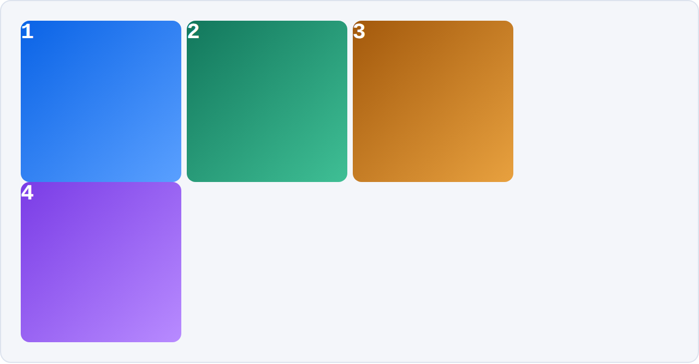

# Layout Cheatsheet: Inline-Block, Flexbox, Grid

Two layouts — a nav bar and a photo grid — each built three ways, so you can see
what changes and what stops being your problem.

`display: inline-block` is the technique we use in class today. Flexbox and grid
are previewed at the end of the lesson, and get full lessons later
(**flexbox in Week 4**, **CSS grid in Week 9**).

> **Want to poke at these live?** Open
> [`layout-playbook.html`](layout-playbook.html) from your clone of this repo —
> double-click it, or right-click → Open With → your browser. The images below
> are screenshots because GitHub strips CSS out of markdown files, so nothing on
> this page can be a real, running layout.

---

## Layout 1 — Nav Bar

A one-row list of links. The markup is the same for all three versions:

```html
<ul class="nav">
  <li>Home</li>
  <li>Projects</li>
  <li>About</li>
  <li>Contact</li>
</ul>
```

### inline-block

```css
.nav { list-style: none; margin: 0; padding: 0; }

.nav li {
  display: inline-block;   /* li is block by default: it refuses to share a line */
  margin: 0;               /* note: zero. see the gaps below anyway. */
}
```


Look at the space between those items. Margin is `0`. That gap is the **line
break between your `<li>` tags in the HTML**, rendered exactly like the space
between two words — because inline-block elements live in an inline formatting
context, the same one that lays out text.

At a default 16px font size that gap measures about **4.5px**. You did not ask
for it, and you cannot remove it with `margin`.

The old-school fixes (you will see all of these in older code):

```css
/* 1. kill the font size on the parent, hand it back to the children */
.nav { font-size: 0; }
.nav li { font-size: 16px; }
```

```html
<!-- 2. delete the whitespace in the HTML -->
<li>Home</li><li>Projects</li><li>About</li>

<!-- 3. comment the whitespace out -->
<li>Home</li><!--
--><li>Projects</li>
```

None of them are good. Keep reading.

### flexbox

```css
.nav {
  display: flex;   /* one property, on the parent */
  gap: 8px;        /* real spacing, no margin math */
}
/* the li rules are gone entirely */
```


The whitespace gap is simply gone — flex items are not in an inline formatting
context, so the whitespace between your tags does not render. The 8px you see is
`gap`, which you asked for.

### grid

```css
.nav {
  display: grid;
  grid-auto-flow: column;        /* lay the items out across, not down */
  grid-auto-columns: max-content;
  gap: 8px;
}
```


Also works, also no whitespace gap. But grid is built to handle rows **and**
columns at once. For a single row of links, flexbox is the more natural tool —
right tool, right job.

---

## Layout 2 — Photo Grid

Four cards, four columns. Same markup every time:

```html
<div class="gallery">
  <div class="tile">1</div>
  <div class="tile">2</div>
  <div class="tile">3</div>
  <div class="tile">4</div>
</div>
```

### inline-block

```css
.tile {
  display: inline-block;
  vertical-align: top;   /* without this, uneven cards sag to different heights */
  width: 23%;
}
```


Two things are doing work here that you should not be relying on:

1. The spacing between cards is that **accidental whitespace gap** again.
2. The `23%` is a number worked out by hand, and it has to leave room for those
   gaps you did not choose.

Push it and it breaks:



That is the same layout at `width: 24.5%`. Four cards at 24.5% is 98% — it
should fit. But three whitespace gaps at ~4.5px each do not fit in the 2% that
is left, so the fourth card wraps to a new row. **This is the math biting.**

### flexbox

```css
.gallery { display: flex; gap: 14px; }
.tile    { flex: 1 1 0; }   /* grow | shrink | starting width */
```


No `vertical-align` fix needed — `align-items` defaults to `stretch`, so the row
equalizes its own heights. No whitespace hack. The cards divide up whatever
space is left after the gaps.

### grid

```css
.gallery {
  display: grid;
  grid-template-columns: repeat(4, 1fr);   /* four equal columns */
  gap: 14px;
}
```


Compare `repeat(4, 1fr)` to working out `100% − (8 × 2%) = 84%`, then
`84% ÷ 4 = 21%` on paper. Grid does the arithmetic. This is grid's sweet spot: a
real two-dimensional grid of equal boxes.

---

## At a glance

| | inline-block | flexbox | grid |
|---|---|---|---|
| Whitespace gap between items | **Yes** | No | No |
| Needs a `vertical-align` fix | **Yes**, for uneven content | No | No |
| Real `gap` property | **No** | Yes | Yes |
| Column math done by hand | **Yes** (% width + margin) | Partly (`flex-basis`) | No |
| Natural fit | small inline bits, text-flow content | one row or column (1D) | rows **and** columns (2D) |
| Where we cover it | Week 3 (today) | Week 4 | Week 9 |

---

## The part that does not change

Everything you learned today about **width, height, border, padding, and
margin** applies identically in all three. A 200px box with a 5px border and
20px of padding measures 250px across whether it is laid out with inline-block,
flexbox, or grid. The box model is the box model — only the way boxes get
arranged next to each other changes.

We are skipping `float` and clearfix entirely. You will see them in older
tutorials and Stack Overflow answers; they were how this was done before flexbox
and grid existed, and you do not need them.
