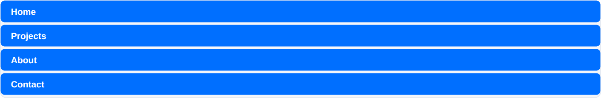
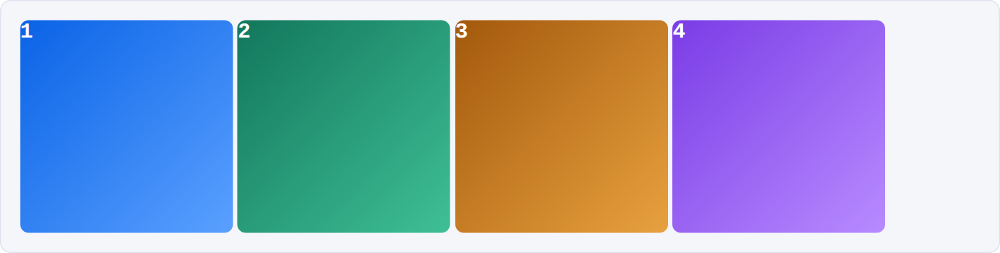
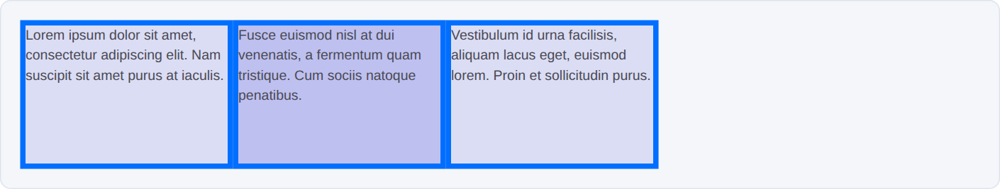
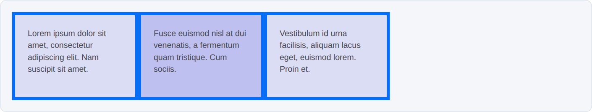
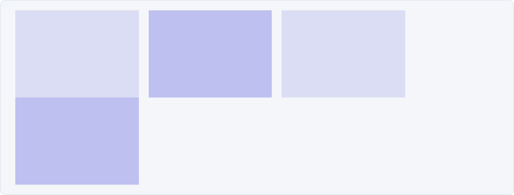

# Week 04 — Box Model and Layout 101

*Two layouts, built by hand, without a single float · ~65 min of live coding*

> **Following along at home?** Work through the steps in order. Each step shows what changed, and the full file underneath it. You start from an empty folder — no starter files this week.

Our plain HTML pages have some default styles applied, but what if we want a more complicated layout? CSS lets us take our **HTML content** and define **styles** for how it looks and how the page is arranged. Today is about the handful of **CSS properties** that affect the **box model** — width, height, margin, border, padding — and then two real layouts built out of them.

We build a **nav bar** and a **photo grid**, both with `display: inline-block`. At the end we look at the same two layouts again in flexbox and grid, so you can see where this is all going.

One thing we are *not* doing: `float`. You will see `float: left` used for layout in older tutorials and Stack Overflow answers. It works, but it pulls elements out of the normal flow of the page, and then you need an extra hack called a clearfix to put the page back together. Flexbox and grid replaced it, for good reasons you will see today.

Stuck? Read the error first, then [TROUBLESHOOTING.md](../../../TROUBLESHOOTING.md).

---

## Steps

1. [Make your own index.html](#step-1)
2. [Make every box visible](#step-2)
3. [A nav bar that doesn't work yet](#step-3)
4. [display: inline-block](#step-4)
5. [The gap nobody asked for](#step-5)
6. [The photo grid](#step-6)
7. [Borders change your numbers](#step-7)
8. [So does padding](#step-8)
9. [Going fluid, and the margin budget](#step-9)
10. [Preview: the same layouts in flexbox](#step-10)
11. [Preview: the same layouts in grid](#step-11)
12. [In-class exercise](#step-12)

At the end: [the three techniques at a glance](#at-a-glance).

---

<a id="step-1"></a>

## Step 1 — Make your own index.html

No starter files this week. Every site you build from here on starts with you making these two files, so make them yourself.

Make a new folder for today in **your own** homework repo — not inside the class repo, or you'll get merge conflicts next time you pull. Inside it, create:

```
box-model/
├── index.html
└── css/
    └── styles.css
```

**`index.html`** — new file. Type it out, don't paste it. You'll write this boilerplate hundreds of times, and it should come out of your fingers without thinking.

```html
<!doctype html>
<html lang="en">
  <head>
    <meta charset="utf-8" />
    <meta name="viewport" content="width=device-width, initial-scale=1" />
    <title>The Box Model</title>
    <link rel="stylesheet" href="./css/styles.css" />
  </head>
  <body>
    <h1>The Box Model</h1>
  </body>
</html>
```

> Once you can write it from memory, VS Code will do it for you: in an empty `.html` file, type `!` and press Tab.

That `<link>` in the `<head>` is an **external stylesheet** — the HTML file holds the content, and a separate `.css` file holds every style rule. The path is relative to `index.html`, so `./css/styles.css` means "the `css` folder next to me, then the file `styles.css` inside it." If your styles never show up, this path is the first thing to check.

**`css/styles.css`** — new file

```css
/* We write this together in class. */
```

Open `index.html` in your browser. A heading on a white page. Let's give ourselves something to look at.

---

<a id="step-2"></a>

## Step 2 — Make every box visible

Before any layout work, two tag selectors. A **tag selector** applies to every instance of that tag on the page, unless something more specific overrides it.

The first sets a font on `<body>`, which trickles down to every child element. The second puts a transparent blue wash on every `<div>` — this one is a debugging trick, not a design decision. You cannot reason about boxes you cannot see.

**`css/styles.css`**

What changed:

```diff
 /* We write this together in class. */
+
+body {
+  font-family: 'Helvetica Neue', Arial, sans-serif;
+  color: #555;
+}
+
+/* every div on the page, so we can SEE our boxes while we work */
+div {
+  background-color: rgba(0, 0, 200, 0.1);
+}
```

<details>
<summary>Full file after this step</summary>

```css
/* We write this together in class. */

body {
  font-family: 'Helvetica Neue', Arial, sans-serif;
  color: #555;
}

/* every div on the page, so we can SEE our boxes while we work */
div {
  background-color: rgba(0, 0, 200, 0.1);
}
```

</details>

`rgba()` is red, green, blue, and **alpha** — the last number is opacity from 0 to 1. At `0.1` it's barely there, which is what we want: enough to see the edges, not enough to fight with anything else.

---

<a id="step-3"></a>

## Step 3 — A nav bar that doesn't work yet

A row of links across the top of a page. This is the most common layout problem on the web, and the markup for it is a plain unordered list — a nav bar *is* a list of links, so that's the honest tag for it.

**`index.html`**

What changed:

```diff
   <body>
     <h1>The Box Model</h1>
+
+    <nav>
+      <ul class="nav">
+        <li class="nav-item"><a href="#">Home</a></li>
+        <li class="nav-item"><a href="#">Projects</a></li>
+        <li class="nav-item"><a href="#">About</a></li>
+        <li class="nav-item"><a href="#">Contact</a></li>
+      </ul>
+    </nav>
   </body>
```

**`css/styles.css`**

What changed:

```diff
 div {
   background-color: rgba(0, 0, 200, 0.1);
 }
+
+.nav {
+  /* kill the bullets and the browser's default list indent */
+  list-style: none;
+  margin: 0;
+  padding: 0;
+}
+
+.nav-item {
+  padding: 12px 20px;
+  background-color: #006FFF;
+}
+
+/* descendant selector: only anchor tags inside a .nav-item */
+.nav-item a {
+  color: white;
+  text-decoration: none;
+}
```

<details>
<summary>Full file after this step</summary>

```css
/* We write this together in class. */

body {
  font-family: 'Helvetica Neue', Arial, sans-serif;
  color: #555;
}

/* every div on the page, so we can SEE our boxes while we work */
div {
  background-color: rgba(0, 0, 200, 0.1);
}

.nav {
  /* kill the bullets and the browser's default list indent */
  list-style: none;
  margin: 0;
  padding: 0;
}

.nav-item {
  padding: 12px 20px;
  background-color: #006FFF;
}

/* descendant selector: only anchor tags inside a .nav-item */
.nav-item a {
  color: white;
  text-decoration: none;
}
```

</details>

Styled, but stacked:



That is not a bug. `<li>` is a **block** element, and block elements always start a new line and take up the full width of their parent, even when there is plenty of room beside them. They refuse to share a line.

`padding: 12px 20px` is shorthand for two values: `12px` top and bottom, `20px` left and right.

---

<a id="step-4"></a>

## Step 4 — display: inline-block

Block elements take a width and a height but won't share a line. **Inline** elements share a line but ignore width and height entirely. We want both, so we want the third option.

**`css/styles.css`**

What changed:

```diff
 .nav-item {
+  /* block: takes width/height, won't share a line
+     inline: shares a line, ignores width/height
+     inline-block: takes width/height AND shares a line */
+  display: inline-block;
   padding: 12px 20px;
   background-color: #006FFF;
 }
```

<details>
<summary>Full file after this step</summary>

```css
/* We write this together in class. */

body {
  font-family: 'Helvetica Neue', Arial, sans-serif;
  color: #555;
}

/* every div on the page, so we can SEE our boxes while we work */
div {
  background-color: rgba(0, 0, 200, 0.1);
}

.nav {
  /* kill the bullets and the browser's default list indent */
  list-style: none;
  margin: 0;
  padding: 0;
}

.nav-item {
  /* block: takes width/height, won't share a line
     inline: shares a line, ignores width/height
     inline-block: takes width/height AND shares a line */
  display: inline-block;
  padding: 12px 20px;
  background-color: #006FFF;
}

/* descendant selector: only anchor tags inside a .nav-item */
.nav-item a {
  color: white;
  text-decoration: none;
}
```

</details>

One property, on the children, and it's a nav bar:


Notice what we did **not** have to do: nothing to the parent `<ul>`. Inline-block elements stay in the normal flow of the page, so the `<ul>` still wraps around them correctly. This is the part floats get wrong — a floated element leaves the flow, its parent collapses to zero height, and you need a clearfix to patch it back up. We skipped that whole category of problem.

---

<a id="step-5"></a>

## Step 5 — The gap nobody asked for

Look closely at that last screenshot. There is a small gap between each nav item. We never wrote a margin. Set one to zero and it's still there:

```css
.nav-item {
  margin: 0;   /* changes nothing */
}
```

That gap is **the line break between your `<li>` tags in the HTML**. Inline-block elements live in an *inline formatting context* — the same one that lays out the words in a paragraph — and in that context, whitespace in your source is rendered, exactly like the space between two words. At a default 16px font size it measures about **4.5px**.

Three ways people deal with it. All three are ugly, which is the point:

```css
/* 1. Zero the font size on the parent, hand it back to the children.
      A space character with no font size has no width. */
.nav {
  font-size: 0;
}

.nav-item {
  font-size: 16px;
}
```

```html
<!-- 2. Delete the whitespace in the HTML -->
<li class="nav-item"><a href="#">Home</a></li><li class="nav-item"><a href="#">Projects</a></li>

<!-- 3. Comment the whitespace out -->
<li class="nav-item"><a href="#">Home</a></li><!--
--><li class="nav-item"><a href="#">Projects</a></li>
```

We'll use the first one, because it keeps the fix in the CSS where layout belongs.

**`css/styles.css`**

What changed:

```diff
 .nav {
   /* kill the bullets and the browser's default list indent */
   list-style: none;
   margin: 0;
   padding: 0;
+  /* kill the whitespace gap between the inline-block children */
+  font-size: 0;
 }
 
 .nav-item {
   display: inline-block;
   padding: 12px 20px;
   background-color: #006FFF;
+  /* hand the font size back, or the links disappear */
+  font-size: 16px;
 }
```

<details>
<summary>Full file after this step</summary>

```css
/* We write this together in class. */

body {
  font-family: 'Helvetica Neue', Arial, sans-serif;
  color: #555;
}

/* every div on the page, so we can SEE our boxes while we work */
div {
  background-color: rgba(0, 0, 200, 0.1);
}

.nav {
  /* kill the bullets and the browser's default list indent */
  list-style: none;
  margin: 0;
  padding: 0;
  /* kill the whitespace gap between the inline-block children */
  font-size: 0;
}

.nav-item {
  /* block: takes width/height, won't share a line
     inline: shares a line, ignores width/height
     inline-block: takes width/height AND shares a line */
  display: inline-block;
  padding: 12px 20px;
  background-color: #006FFF;
  /* hand the font size back, or the links disappear */
  font-size: 16px;
}

/* descendant selector: only anchor tags inside a .nav-item */
.nav-item a {
  color: white;
  text-decoration: none;
}
```

</details>

Remember this one. It comes back in about four minutes.

---

<a id="step-6"></a>

## Step 6 — The photo grid

Second layout: a grid of cards, the kind you'd use for a portfolio or a photo gallery. Same core problem — get block boxes to sit in a row — but this time we care about the **size** of each box, which is where the box model actually starts to bite.

**`index.html`**

What changed:

```diff
     </nav>
+
+    <div class="gallery">
+      <div class="gallery-item"></div>
+      <div class="gallery-item"></div>
+      <div class="gallery-item"></div>
+      <div class="gallery-item"></div>
+    </div>
   </body>
```

**`css/styles.css`**

What changed:

```diff
 .nav-item a {
   color: white;
   text-decoration: none;
 }
+
+.gallery {
+  width: 900px;
+  /* auto on left/right centers the container.
+     margin does NOT add to the box -- personal space outside it. */
+  margin: 0 auto;
+  /* padding DOES add to the box: 900 + 10 + 10 = 920px wide now */
+  padding: 10px;
+}
+
+.gallery-item {
+  display: inline-block;
+  /* inline-block defaults to vertical-align: baseline, which lines boxes up
+     like letters sitting on a line of text. Once the cards hold different
+     amounts of content they sag to different heights. top fixes that. */
+  vertical-align: top;
+  width: 200px;
+  height: 200px;
+}
```

<details>
<summary>Full file after this step</summary>

```css
/* We write this together in class. */

body {
  font-family: 'Helvetica Neue', Arial, sans-serif;
  color: #555;
}

/* every div on the page, so we can SEE our boxes while we work */
div {
  background-color: rgba(0, 0, 200, 0.1);
}

.nav {
  list-style: none;
  margin: 0;
  padding: 0;
  font-size: 0;
}

.nav-item {
  display: inline-block;
  padding: 12px 20px;
  background-color: #006FFF;
  font-size: 16px;
}

.nav-item a {
  color: white;
  text-decoration: none;
}

.gallery {
  width: 900px;
  /* auto on left/right centers the container.
     margin does NOT add to the box -- personal space outside it. */
  margin: 0 auto;
  /* padding DOES add to the box: 900 + 10 + 10 = 920px wide now */
  padding: 10px;
}

.gallery-item {
  display: inline-block;
  /* inline-block defaults to vertical-align: baseline, which lines boxes up
     like letters sitting on a line of text. Once the cards hold different
     amounts of content they sag to different heights. top fixes that. */
  vertical-align: top;
  width: 200px;
  height: 200px;
}
```

</details>

Four cards, four columns — and there is that gap again:



Same cause, same fix, plus a real margin now that the spacing is ours to choose:

```diff
 .gallery {
   width: 900px;
   margin: 0 auto;
   padding: 10px;
+  font-size: 0;
 }
 
 .gallery-item {
   display: inline-block;
   vertical-align: top;
   width: 200px;
   height: 200px;
+  /* now that the accidental gap is gone, spacing is a decision */
+  margin: 0 10px;
+  font-size: 16px;
 }
```


Check the arithmetic: 4 cards × 200px + 8 margins × 10px = 880px, inside a 900px container. It fits, with 20px to spare. Hold onto that habit — we are about to do it again with harder numbers.

---

<a id="step-7"></a>

## Step 7 — Borders change your numbers

Add a border and watch the layout move.

**`index.html`**

What changed:

```diff
     </div>
+
+    <div class="gallery">
+      <div class="gallery-item-border"></div>
+      <div class="gallery-item-border"></div>
+      <div class="gallery-item-border"></div>
+    </div>
   </body>
```

**`css/styles.css`**

What changed:

```diff
+.gallery-item-border {
+  display: inline-block;
+  vertical-align: top;
+  width: 190px;
+  height: 130px;
+  border-width: 5px;
+  border-style: solid;
+  border-color: #006FFF;
+  font-size: 16px;
+}
```


Here is the whole point of today:

```
190px of content
+   5px border on the left
+   5px border on the right
= 200px on the page
```

The number in your `width` property is **not** the number the box occupies. If a box has to end up exactly 200px wide, and it has a 5px border, you declare `width: 190px`.

`#006FFF` is a **hexadecimal** colour — `#RRGGBB`, two hex digits each for red, green, and blue.

---

<a id="step-8"></a>

## Step 8 — So does padding

Same boxes, now with content in them. The placeholder text is from [lipsum.com](http://www.lipsum.com), which is a genuinely useful site for testing layouts before you have real copy.

**`index.html`**

What changed:

```diff
     </div>
+
+    <div class="gallery">
+      <div class="gallery-item-padding">Lorem ipsum dolor sit amet, consectetur adipiscing elit. Nam suscipit sit amet.</div>
+      <div class="gallery-item-padding">Fusce euismod nisl at dui venenatis, a fermentum quam tristique. Cum sociis.</div>
+      <div class="gallery-item-padding">Vestibulum id urna facilisis, aliquam lacus eget, euismod lorem. Proin et.</div>
+    </div>
   </body>
```

With the border rules from the last step and nothing else, the text is jammed right against the border:



Unreadable. That's what padding is for — but padding costs width, so the math has to be redone:

**`css/styles.css`**

What changed:

```diff
+.gallery-item-padding {
+  display: inline-block;
+  vertical-align: top;
+  /* shorthand: width | style | color */
+  border: 5px solid #006FFF;
+  /* give the text some air */
+  padding: 20px;
+  /* ...which just added 40px across. Same 200px box as before:
+     150 content + 40 padding + 10 border = 200 */
+  width: 150px;
+  height: 90px;
+  font-size: 13px;
+}
```



Both of these boxes take up exactly **200px** on the page:

| | content | padding | border | on the page |
|---|---|---|---|---|
| Step 7 | 190px | 0 | 5 + 5 | **200px** |
| Step 8 | 150px | 20 + 20 | 5 + 5 | **200px** |

Same outer box, different amounts of room inside. That is the box model.

> There is a property called `box-sizing: border-box` that flips this around, so `width` means the *final* width and the browser does the subtraction for you. Nearly every real project turns it on. We are doing it by hand first, once, so you know what it's doing for you.

---

<a id="step-9"></a>

## Step 9 — Going fluid, and the margin budget

Browser windows come in every size. Percentages instead of pixels give us a layout that scales — and a new way to get the math wrong.

**`index.html`**

What changed:

```diff
     </div>
+
+    <div class="gallery-fluid">
+      <div class="gallery-item-fluid"></div>
+      <div class="gallery-item-fluid"></div>
+      <div class="gallery-item-fluid"></div>
+      <div class="gallery-item-fluid"></div>
+    </div>
   </body>
```

**`css/styles.css`**

What changed:

```diff
+.gallery-fluid {
+  width: 90%;
+  margin: 0 auto;
+  padding: 2%;
+  font-size: 0;
+}
+
+.gallery-item-fluid {
+  display: inline-block;
+  vertical-align: top;
+  width: 25%;
+  height: 160px;
+  margin: 0 1%;
+  font-size: 16px;
+}
```

A percentage is always a percentage **of the parent's width** — including margins. So:

```
4 cards  × 25% = 100%
8 margins × 1% =   8%
                 ----
                 108%
```

108% does not fit in 100%, so the fourth card wraps:



Budget it properly. Decide the margin first, then let the cards divide what's left:

```
100% − (8 × 2%) = 84% for the cards
84% ÷ 4         = 21% each
```

```diff
 .gallery-item-fluid {
   display: inline-block;
   vertical-align: top;
-  width: 25%;
+  width: 21%;
   height: 160px;
-  margin: 0 1%;
+  margin: 0 2%;
   font-size: 16px;
 }
```


<details>
<summary>Full <code>css/styles.css</code> at the end of the inline-block build</summary>

```css
/* We write this together in class. */

body {
  font-family: 'Helvetica Neue', Arial, sans-serif;
  color: #555;
}

/* every div on the page, so we can SEE our boxes while we work */
div {
  background-color: rgba(0, 0, 200, 0.1);
}

/* ---------- nav bar ---------- */

.nav {
  list-style: none;
  margin: 0;
  padding: 0;
  font-size: 0;
}

.nav-item {
  display: inline-block;
  padding: 12px 20px;
  background-color: #006FFF;
  font-size: 16px;
}

.nav-item a {
  color: white;
  text-decoration: none;
}

/* ---------- photo grid, fixed pixels ---------- */

.gallery {
  width: 900px;
  margin: 0 auto;
  padding: 10px;
  font-size: 0;
}

.gallery-item {
  display: inline-block;
  vertical-align: top;
  width: 200px;
  height: 200px;
  margin: 0 10px;
  font-size: 16px;
}

/* ---------- borders and padding ---------- */

.gallery-item-border {
  display: inline-block;
  vertical-align: top;
  width: 190px;          /* 190 + 5 + 5 = 200 on the page */
  height: 130px;
  border: 5px solid #006FFF;
  font-size: 16px;
}

.gallery-item-padding {
  display: inline-block;
  vertical-align: top;
  width: 150px;          /* 150 + 40 padding + 10 border = 200 */
  height: 90px;
  border: 5px solid #006FFF;
  padding: 20px;
  font-size: 13px;
}

/* ---------- photo grid, fluid ---------- */

.gallery-fluid {
  width: 90%;
  margin: 0 auto;
  padding: 2%;
  font-size: 0;
}

.gallery-item-fluid {
  display: inline-block;
  vertical-align: top;
  width: 21%;            /* 100% - (8 x 2% margin) = 84%, / 4 = 21% */
  height: 160px;
  margin: 0 2%;
  font-size: 16px;
}
```

</details>

---

<a id="step-10"></a>

## Step 10 — Preview: the same layouts in flexbox

Everything above is a real technique, and the box-model math you just did applies **everywhere**. But look what happens to these two layouts when we change one property on the parent.

Don't type these into your file — just watch. Flexbox gets its full lesson **this Thursday**.

**Nav bar**

```css
.nav {
  display: flex;
  gap: 8px;
  list-style: none;
  margin: 0;
  padding: 0;
}
```


The `.nav-item` rules are gone. No `display: inline-block` on the children, no `font-size: 0`, no handing the font size back. Flex items are not in an inline formatting context, so the whitespace gap never happens — and `gap` gives us real spacing with no margin math and no doubling.

**Photo grid**

```css
.gallery {
  display: flex;
  gap: 20px;
}

.gallery-item {
  flex: 1 1 200px;   /* grow | shrink | starting width */
  height: 200px;
}
```


`vertical-align: top` is gone too — `align-items` defaults to `stretch`, so a flex row equalizes its own heights.

---

<a id="step-11"></a>

## Step 11 — Preview: the same layouts in grid

Same markup again, different one-line change. CSS Grid gets its full lesson in **Week 9**.

**Nav bar**

```css
.nav {
  display: grid;
  grid-auto-flow: column;   /* lay items out across, not down */
  grid-auto-columns: max-content;
  gap: 8px;
}
```


Works, and no whitespace gap here either. But grid is built to handle rows **and** columns at once — for a single row of links, flexbox is the more natural tool. Right tool, right job.

**Photo grid**

```css
.gallery {
  display: grid;
  grid-template-columns: repeat(4, 1fr);   /* four equal columns */
  gap: 20px;
}
```


Compare `repeat(4, 1fr)` to what we did in Step 9 — `100% − (8 × 2%) = 84%`, then `84% ÷ 4 = 21%`, worked out on paper. Grid does that arithmetic itself. This is grid's sweet spot: a genuine two-dimensional grid of equal boxes.

> **Want to poke at all six versions side by side?** Open [`layout-playbook.html`](layout-playbook.html) from your copy of this folder — double-click it, or right-click → Open With → your browser. Every layout on that page is live CSS you can inspect with dev tools.

---

<a id="step-12"></a>

## Step 12 — In-class exercise

The cards below need air between them. Using `display: inline-block` and **pixel** margins, rework either the container class (addition) or the card class (subtraction) so this sits in one row of four columns — and deal with the whitespace gap however you like.

Start from scratch with these class names. Do not copy the earlier rules.

```html
<h3>In Class Exercise</h3>
<div class="gallery-inclass">
  <div class="gallery-item-inclass"></div>
  <div class="gallery-item-inclass"></div>
  <div class="gallery-item-inclass"></div>
  <div class="gallery-item-inclass"></div>
</div>
```

Show your working. Write the arithmetic in a CSS comment above the rule, the way we did in Step 6 and Step 9 — if the numbers don't add up on paper, they won't add up on the page either.

---

<a id="at-a-glance"></a>

## At a glance

| | inline-block | flexbox | grid |
|---|---|---|---|
| Whitespace gap between items | **Yes** | No | No |
| Needs a `vertical-align` fix | **Yes**, for uneven content | No | No |
| Real `gap` property | **No** | Yes | Yes |
| Column math done by hand | **Yes** (% width + margin) | Partly (`flex-basis`) | No |
| Natural fit | small inline bits, text-flow content | one row or column (1D) | rows **and** columns (2D) |
| Where we cover it | Week 4 Tuesday (today) | Week 4 Thursday | Week 9 |

## The part that doesn't change

Width, height, margin, border, and padding behave identically in all three. A box with 150px of content, 20px of padding, and a 5px border measures 200px across whether it was placed by inline-block, flexbox, or grid. The box model is the box model — the only thing that changes is how boxes get arranged next to each other.

Which is why we spent today on the math instead of on `float`.
