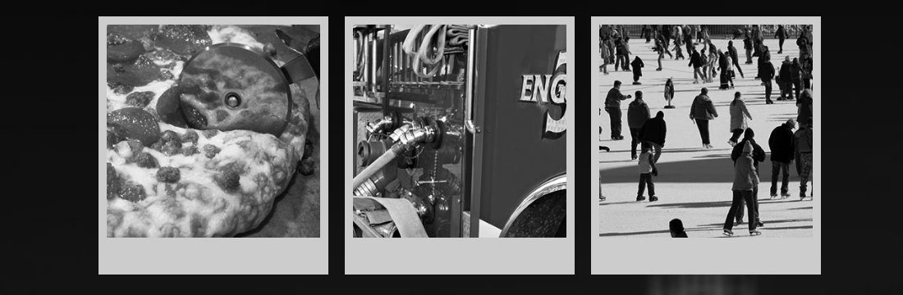
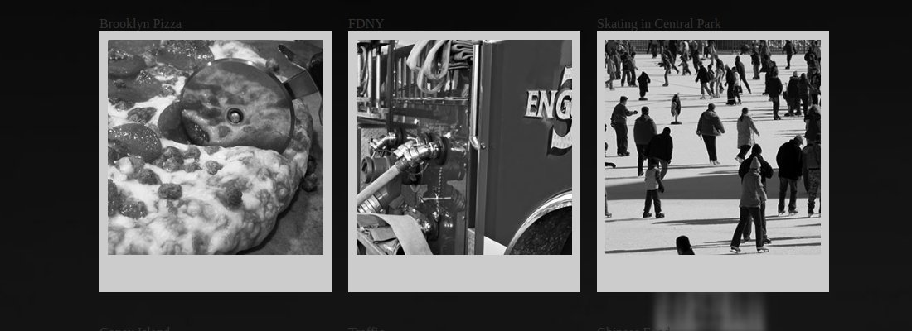
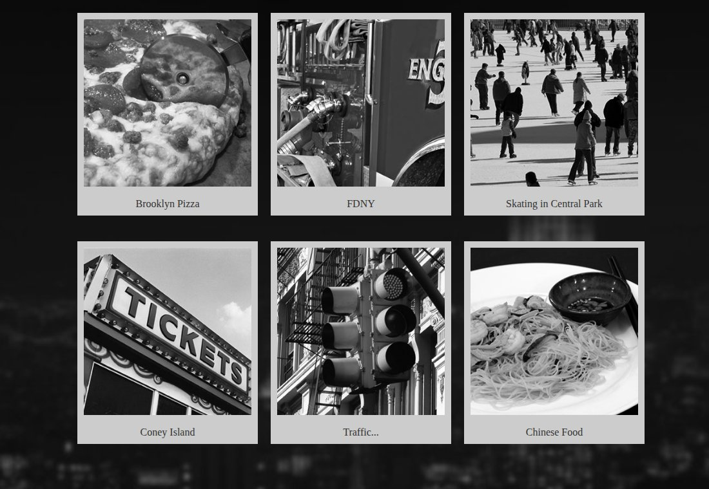
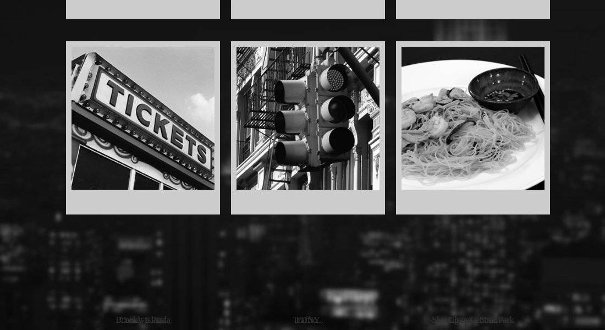

# Week 04 — NYC Gallery

*A photo gallery that looks like a real website · ~30 min of live coding*

> **Following along at home?** Work through the steps in order. Each step shows what changed, and the full file underneath it. Everything starts from `StarterFiles/`.

This morning was the box model on plain boxes. Now we put it on something that looks like a website: a wall of polaroid photos of New York over a full-screen skyline.

Almost all of it is things you already know — inline-block, the whitespace gap, borders, and box-model math. **One piece is new: getting each caption into the polaroid's frame needs CSS positioning.** Positioning gets its own lesson next Tuesday; today it shows up at the end as a sneak peek, so you see why you'll need it.

Stuck? Read the error first, then [TROUBLESHOOTING.md](../../../TROUBLESHOOTING.md).

---

## Steps

1. [Start from the starter](#step-1)
2. [A reset and a font](#step-2)
3. [A full-page background](#step-3)
4. [Polaroids in a row](#step-4)
5. [Frame the photos](#step-5)
6. [Bring the captions back](#step-6)
7. [Sneak peek: positioning](#step-7)
8. [If you finish early](#step-8)

---

<a id="step-1"></a>

## Step 1 — Start from the starter

Copy `StarterFiles/` out of the class repo into your own folder, next to the Box Model work from this morning.

Open `index.html` and read it first. It's short: one `.container` holding six `.polaroid`s, and each polaroid is a caption (`<p>`) followed by a photo (``). The photos are in `img/bw/`, and there's a background image at `img/bg.jpg`.

The `<head>` has a comment where the stylesheet link should go. Add it yourself — same as the start of today's lesson. Note the file name: this project uses **`style.css`**, not `styles.css`. If nothing you write shows up, check the name before anything else.

**`index.html`**

What changed:

```diff
     <title>New York City Gallery</title>
     <!-- Link to CSS File here -->
+    <link rel="stylesheet" href="./css/style.css" />
     <!-- Link to Google Font Here -->
 </head>
```

---

<a id="step-2"></a>

## Step 2 — A reset and a font

Three things, in a deliberate order.

**Load dependencies first.** `@import` pulls in another stylesheet — here, a handwritten-looking Google Font called Kaushan Script. An `@import` has to come before every other rule in the file, or the browser ignores it.

**Then a reset.** `*` is the **universal selector**: it matches every element on the page. Zeroing margin and padding on everything removes the browser's default spacing, so every gap you see from here on is one you put there.

**Then generic to specific.** The font goes on `html` so every element inherits it, and later rules get more and more specific. Always order your CSS that way.

**`css/style.css`**

What changed:

```diff
@@ -1 +1,12 @@
-/* empty -- we write this together */
+/* always load dependencies first - fonts, css variables, other style sheets */
+@import url('https://fonts.googleapis.com/css2?family=Kaushan+Script&display=swap');
+
+/* generic to specific with our styles */
+* {
+  margin: 0;
+  padding: 0;
+}
+
+html {
+  font-family: 'Kaushan Script', cursive;
+}
```

<details>
<summary>Full file after this step</summary>

```css
/* always load dependencies first - fonts, css variables, other style sheets */
@import url('https://fonts.googleapis.com/css2?family=Kaushan+Script&display=swap');

/* generic to specific with our styles */
* {
  margin: 0;
  padding: 0;
}

html {
  font-family: 'Kaushan Script', cursive;
}
```

</details>

---

<a id="step-3"></a>

## Step 3 — A full-page background

`background` is a **shorthand** — five settings on one line:

| part | value | meaning |
|---|---|---|
| image | `url('../img/bg.jpg')` | the path is relative to **the CSS file**, not the HTML file — hence `../` to climb out of `css/` |
| repeat | `no-repeat` | one copy, no tiling |
| position | `center center` | centered horizontally and vertically |
| attachment | `fixed` | the background stays put while the page scrolls over it |

`background-size: cover` then scales the image until it covers the whole screen, cropping whatever doesn't fit.


**`css/style.css`**

What changed:

```diff
@@ -10,3 +10,7 @@
 html {
   font-family: 'Kaushan Script', cursive;
+
+  /* this is where we would declare and use a full size image background */
+  background: url('../img/bg.jpg') no-repeat center center fixed;
+  background-size: cover;
 }
```

<details>
<summary>Full file after this step</summary>

```css
/* always load dependencies first - fonts, css variables, other style sheets */
@import url('https://fonts.googleapis.com/css2?family=Kaushan+Script&display=swap');

/* generic to specific with our styles */
* {
  margin: 0;
  padding: 0;
}

html {
  font-family: 'Kaushan Script', cursive;

  /* this is where we would declare and use a full size image background */
  background: url('../img/bg.jpg') no-repeat center center fixed;
  background-size: cover;
}
```

</details>

---

<a id="step-4"></a>

## Step 4 — Polaroids in a row

Now the part you already know from this morning. The container gets a width and is centered with `margin: 0 auto`, and each polaroid becomes an **inline-block** so they share a row.

And, same as this morning, inline-block brings the whitespace gap with it — so `font-size: 0` goes on the container. Keep an eye on that line. It comes back to bite us in two steps.

Check the row math before you trust it:

```
one polaroid = 20px margin + 260px + 20px margin = 300px
3 polaroids  × 300px                             = 900px   <- exactly the container
```

Three per row, two rows.


The boxes are right. The photos aren't: they're drawn at their natural size (300px), which is wider than the 260px polaroid they're sitting in, so they spill over and overlap their neighbours.

**`css/style.css`**

What changed:

```diff
@@ -15,2 +15,16 @@
   background-size: cover;
 }
+
+.container {
+  width: 900px;
+  margin: 0 auto;
+  /* rememeber to zero out font size of the container of inline block elements
+  dont forget to bring that font size back in the child element */
+  font-size: 0;
+}
+
+.polaroid {
+  width: 260px;
+  margin: 20px;
+  display: inline-block;
+}
```

<details>
<summary>Full file after this step</summary>

```css
/* always load dependencies first - fonts, css variables, other style sheets */
@import url('https://fonts.googleapis.com/css2?family=Kaushan+Script&display=swap');

/* generic to specific with our styles */
* {
  margin: 0;
  padding: 0;
}

html {
  font-family: 'Kaushan Script', cursive;

  /* this is where we would declare and use a full size image background */
  background: url('../img/bg.jpg') no-repeat center center fixed;
  background-size: cover;
}

.container {
  width: 900px;
  margin: 0 auto;
  /* rememeber to zero out font size of the container of inline block elements
  dont forget to bring that font size back in the child element */
  font-size: 0;
}

.polaroid {
  width: 260px;
  margin: 20px;
  display: inline-block;
}
```

</details>

---

<a id="step-5"></a>

## Step 5 — Frame the photos

A common design pattern: **never size an image directly.** Size the box it lives in, and make the image `width: 100%` of that box, with `height: auto` so it keeps its proportions.

The polaroid look is just borders: 10px of light grey all round, then `border-bottom-width` overrides the bottom one to 45px, for the thick strip where you'd write on a real polaroid.



Two questions before you move on:

**1. How wide is each photo now?** `width: 100%` of a 260px box — so 260px? Open dev tools and inspect one: it's **280px**. `width` sets the *content* width; the 10px left and right borders are added on top: 260 + 10 + 10 = 280. It's the exact math from this morning's border step. It doesn't wreck the layout only because it spills into the 20px margin. Remember the 280; we'll need it.

**2. Where did the captions go?** They're still in the HTML.

**`css/style.css`**

What changed:

```diff
@@ -29,2 +29,12 @@
   display: inline-block;
 }
+
+.polaroid img {
+  /* common design pattern is to never size images themselves
+  instead we make the image width 100% of its parent. and then assign dimensions to the parent */
+  width: 100%;
+  height: auto;
+  /* add some borders to mimic polaroid paper */
+  border: 10px solid #ccc;
+  border-bottom-width: 45px;
+}
```

<details>
<summary>Full file after this step</summary>

```css
/* always load dependencies first - fonts, css variables, other style sheets */
@import url('https://fonts.googleapis.com/css2?family=Kaushan+Script&display=swap');

/* generic to specific with our styles */
* {
  margin: 0;
  padding: 0;
}

html {
  font-family: 'Kaushan Script', cursive;

  /* this is where we would declare and use a full size image background */
  background: url('../img/bg.jpg') no-repeat center center fixed;
  background-size: cover;
}

.container {
  width: 900px;
  margin: 0 auto;
  /* rememeber to zero out font size of the container of inline block elements
  dont forget to bring that font size back in the child element */
  font-size: 0;
}

.polaroid {
  width: 260px;
  margin: 20px;
  display: inline-block;
}

.polaroid img {
  /* common design pattern is to never size images themselves
  instead we make the image width 100% of its parent. and then assign dimensions to the parent */
  width: 100%;
  height: auto;
  /* add some borders to mimic polaroid paper */
  border: 10px solid #ccc;
  border-bottom-width: 45px;
}
```

</details>

---

<a id="step-6"></a>

## Step 6 — Bring the captions back

Back in Step 4 we put `font-size: 0` on the container to kill the whitespace gap. Font size is **inherited**, so every caption inside it is now 0px tall — the text is there, just infinitely small. That's the other half of this morning's rule: zero it on the parent, then *hand it back* to the children.

Why `1rem` and not `1em`?

- `em` is relative to the **parent's** font size. The parent's is 0, and 1 × 0 = 0. Still invisible.
- `rem` ("root em") is relative to the **root** `html` element's font size — 16px by default — no matter what the parents are doing.



The captions are back, but they sit *above* the photo, because that's where the `<p>` is in the HTML. Normal page flow puts things in source order. To get the caption down into that thick bottom border, we need to take it out of the flow and place it by hand — and that needs a new tool.

**`css/style.css`**

What changed:

```diff
@@ -39,2 +39,7 @@
   border-bottom-width: 45px;
 }
+
+.polaroid p {
+  font-size: 1rem;
+  color: #333;
+}
```

<details>
<summary>Full file after this step</summary>

```css
/* always load dependencies first - fonts, css variables, other style sheets */
@import url('https://fonts.googleapis.com/css2?family=Kaushan+Script&display=swap');

/* generic to specific with our styles */
* {
  margin: 0;
  padding: 0;
}

html {
  font-family: 'Kaushan Script', cursive;

  /* this is where we would declare and use a full size image background */
  background: url('../img/bg.jpg') no-repeat center center fixed;
  background-size: cover;
}

.container {
  width: 900px;
  margin: 0 auto;
  /* rememeber to zero out font size of the container of inline block elements
  dont forget to bring that font size back in the child element */
  font-size: 0;
}

.polaroid {
  width: 260px;
  margin: 20px;
  display: inline-block;
}

.polaroid img {
  /* common design pattern is to never size images themselves
  instead we make the image width 100% of its parent. and then assign dimensions to the parent */
  width: 100%;
  height: auto;
  /* add some borders to mimic polaroid paper */
  border: 10px solid #ccc;
  border-bottom-width: 45px;
}

.polaroid p {
  font-size: 1rem;
  color: #333;
}
```

</details>

---

<a id="step-7"></a>

## Step 7 — Sneak peek: positioning

> **This step uses CSS positioning, which gets its own full lesson next Tuesday (Week 5).** You don't need to master it today. You need to see *why* it exists: some designs — a caption printed on a photo frame — can't be done with the page's normal flow, and positioning is how you step outside it.

The two halves always come as a pair:

- `position: absolute` on the **caption** takes it out of the normal flow entirely — the rest of the page acts like it's not there — and lets you place it with `top`, `bottom`, `left` and `right`. `bottom: 9px` puts it 9px up from the bottom edge.
- `position: relative` on the **polaroid** says *"measure from me."* An absolutely positioned element measures from its nearest positioned ancestor.

`width: 280px` matches the photo's real width from Step 5 — not the 260px we typed — so `text-align: center` centers the caption under the photo, not under the box.



**Try it: delete `position: relative` from `.polaroid`.** The captions no longer have a positioned ancestor, so they measure from the whole browser window instead — and all six land in the same spot at the bottom of the screen, printed on top of each other:



Put it back. That pair — `relative` on the parent, `absolute` on the child — is most of what you'll use positioning for.

*(The captions in these screenshots are in a fallback font; in your browser they'll be in Kaushan Script.)*

**`css/style.css`**

What changed:

```diff
@@ -28,4 +28,5 @@
   margin: 20px;
   display: inline-block;
+  position: relative;
 }
 
@@ -43,3 +44,7 @@
   font-size: 1rem;
   color: #333;
+  position: absolute;
+  bottom: 9px;
+  width: 280px;
+  text-align: center;
 }
```

<details>
<summary>Full file after this step</summary>

```css
/* always load dependencies first - fonts, css variables, other style sheets */
@import url('https://fonts.googleapis.com/css2?family=Kaushan+Script&display=swap');

/* generic to specific with our styles */
* {
  margin: 0;
  padding: 0;
}

html {
  font-family: 'Kaushan Script', cursive;

  /* this is where we would declare and use a full size image background */
  background: url('../img/bg.jpg') no-repeat center center fixed;
  background-size: cover;
}

.container {
  width: 900px;
  margin: 0 auto;
  /* rememeber to zero out font size of the container of inline block elements
  dont forget to bring that font size back in the child element */
  font-size: 0;
}

.polaroid {
  width: 260px;
  margin: 20px;
  display: inline-block;
  position: relative;
}

.polaroid img {
  /* common design pattern is to never size images themselves
  instead we make the image width 100% of its parent. and then assign dimensions to the parent */
  width: 100%;
  height: auto;
  /* add some borders to mimic polaroid paper */
  border: 10px solid #ccc;
  border-bottom-width: 45px;
}

.polaroid p {
  font-size: 1rem;
  color: #333;
  position: absolute;
  bottom: 9px;
  width: 280px;
  text-align: center;
}
```

</details>

---

<a id="step-8"></a>

## Step 8 — If you finish early

- **Add a seventh polaroid.** Where does it go, and why? (Hint: three per row.)
- **Swap in a colour photo.** There are colour versions of every photo in `img/color/` — some of the file names are slightly different, so check the folder.
- **Try `box-sizing: border-box` on `.polaroid img`.** The photo shrinks back to 260px — so what happens to the caption, which is still 280px wide?

---

## What you used

| | where it showed up |
|---|---|
| `display: inline-block` + `font-size: 0` | the polaroids in a row, without the whitespace gap |
| box-model math | 20 + 260 + 20 = 300px per polaroid, 3 × 300 = 900px per row; the 280px photo |
| `width: 100%; height: auto` on images | size the box, not the image |
| `border` + `border-bottom-width` | the polaroid frame |
| `rem` vs `em` | getting text back inside a `font-size: 0` container |
| `position: relative` + `position: absolute` | the caption in the frame — **full lesson next Tuesday** |
