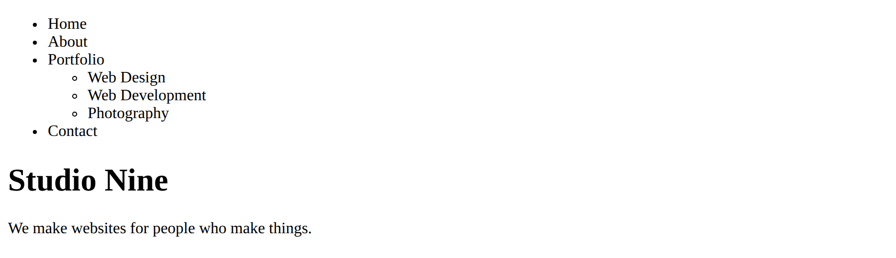
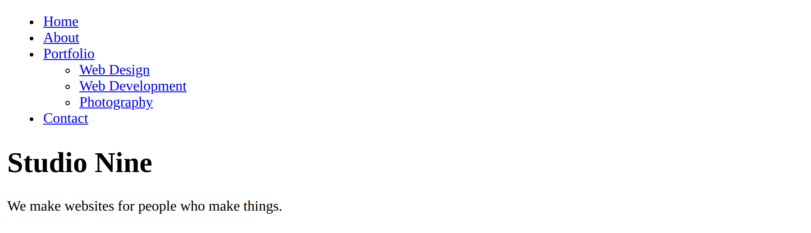
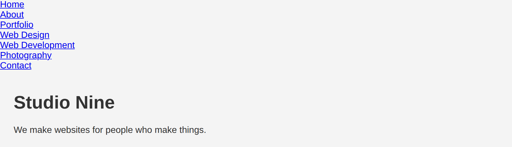
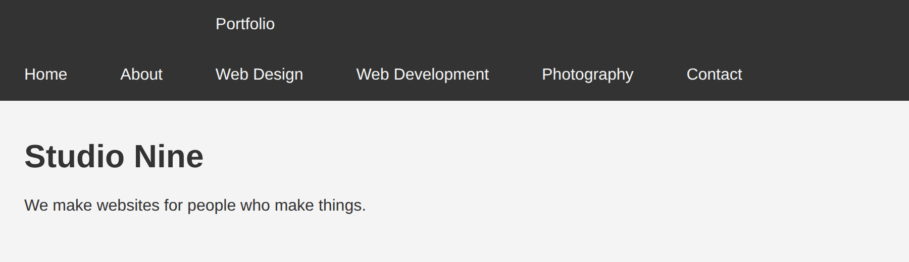
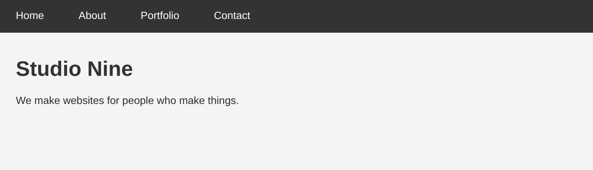
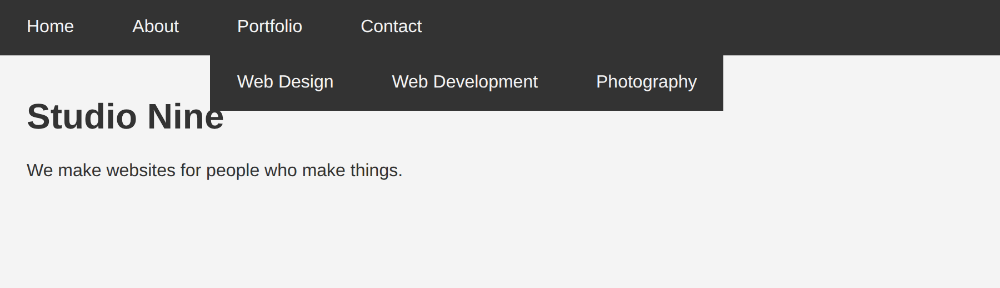
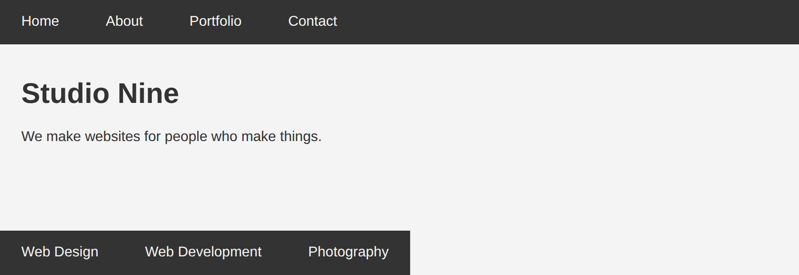
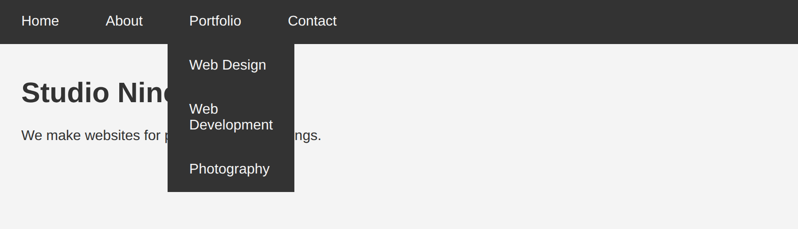
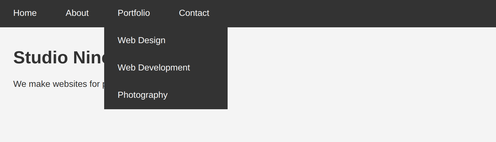
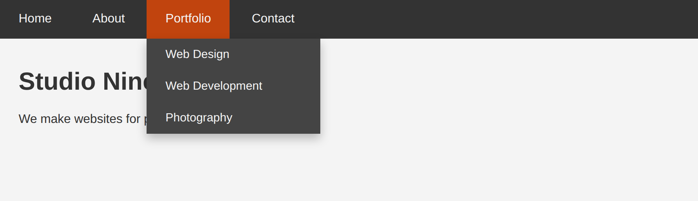

# Week 05 — The Dropdown Nav

*A hover menu built out of a nested list, no JavaScript · ~40 min of live coding*

> **Following along at home?** Work through the steps in order. Each step shows what changed, and the full file underneath it. You make your own files again this week — there are no starter files.

Every site you built so far has a flat nav bar. Real sites have menus that open. Today we build one out of the HTML you already know — a list inside a list — and four CSS properties, three of which you learned last Thursday.

There is no JavaScript here. The whole thing runs on `:hover` and `position: absolute`. When you see a nav menu open on a site you like, this is very often all that is happening.

This is also the first lesson where **positioning does the heavy lifting**. If `position: relative` and `position: absolute` are still fuzzy from Thursday, this is the lesson that makes them stick, because you will watch the menu land in the wrong place until you fix it.

Stuck? Read the error first, then [TROUBLESHOOTING.md](../../../TROUBLESHOOTING.md).

---

## Steps

1. [Make your own files](#step-1)
2. [A nav is a list of links](#step-2)
3. [Stop it from looking like a list](#step-3)
4. [Lay the bar out — and meet the problem](#step-4)
5. [Hide it, show it on hover](#step-5)
6. [Get it out of the flow](#step-6)
7. [Drop it below the bar — 100% of what?](#step-7)
8. [The one line that fixes everything](#step-8)
9. [Stack the items, set a width](#step-9)
10. [Make it look like a menu](#step-10)
11. [In-class exercise](#step-11)

At the end: [the four rules of a dropdown](#at-a-glance) and [a note on keyboards](#keyboards).

---

<a id="step-1"></a>

## Step 1 — Make your own files

Same as last week: no starter files. In **your own** homework repo, make a folder for today:

```
dropdown/
├── index.html
└── css/
    └── styles.css
```

**`index.html`** — new file. Type it out.

```html
<!doctype html>
<html lang="en">
  <head>
    <meta charset="utf-8" />
    <meta name="viewport" content="width=device-width, initial-scale=1" />
    <title>Navbar Dropdown</title>
    <link rel="stylesheet" href="./css/styles.css" />
  </head>
  <body>
    <nav>
      <ul>
        <li>Home</li>
        <li>About</li>
        <li>
          Portfolio
          <ul>
            <li>Web Design</li>
            <li>Web Development</li>
            <li>Photography</li>
          </ul>
        </li>
        <li>Contact</li>
      </ul>
    </nav>

    <main>
      <h1>Studio Nine</h1>
      <p>We make websites for people who make things.</p>
    </main>
  </body>
</html>
```

Two things to notice in that markup, because the whole lesson depends on them:

- The submenu is a **`<ul>` inside an `<li>`**. Not next to it — *inside* it. The Portfolio item contains its own little list. That nesting is what lets us say "when you hover Portfolio, show the list inside Portfolio."
- There is a `<main>` under the nav with real content in it. We need something for the menu to cover, or you cannot tell whether it is floating above the page or shoving the page around.

**`css/styles.css`** — new file

```css
/* We write this together in class. */
```

Open it in the browser. A bulleted list, with an indented bulleted list inside it.



Ugly, but correct. The browser is telling us the truth about our HTML: there is a list, and one of its items contains another list.

---

<a id="step-2"></a>

## Step 2 — A nav is a list of links

Right now these are just words. A nav is made of **links**, so wrap every label in an `<a>`. We do not have other pages yet, so every `href` is `#` — a link that goes nowhere, which is a normal placeholder while you build.

**`index.html`**

```diff
-        <li>Home</li>
-        <li>About</li>
+        <li><a href="#">Home</a></li>
+        <li><a href="#">About</a></li>
         <li>
-          Portfolio
+          <a href="#">Portfolio</a>
           <ul>
-            <li>Web Design</li>
+            <li><a href="#">Web Design</a></li>
```

...and the same for the rest.

<details>
<summary>Full file after this step</summary>

```html
<!doctype html>
<html lang="en">
  <head>
    <meta charset="utf-8" />
    <meta name="viewport" content="width=device-width, initial-scale=1" />
    <title>Navbar Dropdown</title>
    <link rel="stylesheet" href="./css/styles.css" />
  </head>
  <body>
    <nav>
      <ul>
        <li><a href="#">Home</a></li>
        <li><a href="#">About</a></li>
        <li>
          <a href="#">Portfolio</a>
          <ul>
            <li><a href="#">Web Design</a></li>
            <li><a href="#">Web Development</a></li>
            <li><a href="#">Photography</a></li>
          </ul>
        </li>
        <li><a href="#">Contact</a></li>
      </ul>
    </nav>

    <main>
      <h1>Studio Nine</h1>
      <p>We make websites for people who make things.</p>
    </main>
  </body>
</html>
```

</details>



Blue and underlined, because that is what a browser does with a link you have not styled. We fix that next.

---

<a id="step-3"></a>

## Step 3 — Stop it from looking like a list

A `<ul>` arrives with three things we do not want: bullets, an outer margin, and a big left padding that produces the indent. Turn all three off. This is the first thing you will ever do to a nav, on every project, forever.

**`css/styles.css`**

What changed:

```diff
@@ -1 +1,19 @@
 /* We write this together in class. */
+
+body {
+  font-family: 'Helvetica Neue', Arial, sans-serif;
+  margin: 0;
+  background-color: #f4f4f4;
+  color: #333;
+}
+
+main {
+  padding: 1rem 1.5rem;
+}
+
+/* a nav is a list, but it should not LOOK like a list */
+nav ul {
+  list-style: none;
+  margin: 0;
+  padding: 0;
+}
```

<details>
<summary>Full file after this step</summary>

```css
/* We write this together in class. */

body {
  font-family: 'Helvetica Neue', Arial, sans-serif;
  margin: 0;
  background-color: #f4f4f4;
  color: #333;
}

main {
  padding: 1rem 1.5rem;
}

/* a nav is a list, but it should not LOOK like a list */
nav ul {
  list-style: none;
  margin: 0;
  padding: 0;
}
```

</details>



Note the selector: `nav ul` hits **both** lists, the outer one and the nested one, because both are `<ul>`s inside the `<nav>`. That is what we want — neither should have bullets.

---

<a id="step-4"></a>

## Step 4 — Lay the bar out, and meet the problem

Now the part you already know from the box model lesson: `display: inline-block` puts list items on one line. We also give the bar a dark background, and turn the links white with some padding so they are comfortable to click.

One new thing: `display: block` on the `<a>`. By default an anchor is inline, which means padding on it does not push the neighbours around properly and only the text itself is clickable. Making it a block lets the padding create a real, full-size click target.

**`css/styles.css`**

What changed:

```diff
@@ -16,4 +16,16 @@
   list-style: none;
   margin: 0;
   padding: 0;
+  background-color: #333;
 }
+
+nav li {
+  display: inline-block;
+}
+
+nav a {
+  display: block;
+  padding: 1rem 1.5rem;
+  color: #f4f4f4;
+  text-decoration: none;
+}
```

<details>
<summary>Full file after this step</summary>

```css
/* We write this together in class. */

body {
  font-family: 'Helvetica Neue', Arial, sans-serif;
  margin: 0;
  background-color: #f4f4f4;
  color: #333;
}

main {
  padding: 1rem 1.5rem;
}

/* a nav is a list, but it should not LOOK like a list */
nav ul {
  list-style: none;
  margin: 0;
  padding: 0;
  background-color: #333;
}

nav li {
  display: inline-block;
}

nav a {
  display: block;
  padding: 1rem 1.5rem;
  color: #f4f4f4;
  text-decoration: none;
}
```

</details>



Well. That is not a nav bar.

Look carefully at what happened, because this is the actual lesson:

- `nav li { display: inline-block }` matched the submenu's items too — they are `<li>`s inside `<nav>` — so **Web Design, Web Development and Photography are now sitting in the bar** as if they were top-level items.
- The Portfolio item is holding all of them, so its box is now **461.8px wide** instead of 106.7px, and the bar is **100px tall instead of 50px** — two rows.
- Contact got shoved off to the right of all of it.

The submenu is not a menu yet. It is just more list items in the bar. Everything from here is about taking it out of that bar and hanging it underneath.

---

<a id="step-5"></a>

## Step 5 — Hide it, show it on hover

The submenu should not be on screen at all until someone hovers Portfolio. `display: none` removes an element completely — not invisible, not transparent, *gone*, as if you deleted it from the HTML.

Then we bring it back with a hover selector. Read `nav li:hover ul` out loud as **"a `ul` inside a nav `li` that is currently being hovered."** That is a *descendant* selector with a `:hover` on the middle part, and it is the whole trick.

**`css/styles.css`**

What changed:

```diff
@@ -29,3 +29,11 @@
   color: #f4f4f4;
   text-decoration: none;
 }
+
+nav li ul {
+  display: none;
+}
+
+nav li:hover ul {
+  display: block;
+}
```

<details>
<summary>Full file after this step</summary>

```css
/* We write this together in class. */

body {
  font-family: 'Helvetica Neue', Arial, sans-serif;
  margin: 0;
  background-color: #f4f4f4;
  color: #333;
}

main {
  padding: 1rem 1.5rem;
}

/* a nav is a list, but it should not LOOK like a list */
nav ul {
  list-style: none;
  margin: 0;
  padding: 0;
  background-color: #333;
}

nav li {
  display: inline-block;
}

nav a {
  display: block;
  padding: 1rem 1.5rem;
  color: #f4f4f4;
  text-decoration: none;
}

nav li ul {
  display: none;
}

nav li:hover ul {
  display: block;
}
```

</details>

Resting:



That is the bar we wanted. Now hover Portfolio:


Better and worse. The menu does appear — but it appears **inside the bar**, so the bar grows to 100px again and Contact jumps. Open a menu on any real site: the page underneath does not move. Ours moves because the submenu is still part of the normal flow, taking up space and pushing its neighbours around.

---

<a id="step-6"></a>

## Step 6 — Get it out of the flow

This is Thursday's lesson. `position: absolute` **takes an element out of the normal flow**. The page lays itself out as if the element were not there, and the element floats above everything else.

**`css/styles.css`**

What changed:

```diff
@@ -32,6 +32,7 @@
 
 nav li ul {
   display: none;
+  position: absolute;
 }
 
 nav li:hover ul {
```

<details>
<summary>Full file after this step</summary>

```css
/* We write this together in class. */

body {
  font-family: 'Helvetica Neue', Arial, sans-serif;
  margin: 0;
  background-color: #f4f4f4;
  color: #333;
}

main {
  padding: 1rem 1.5rem;
}

/* a nav is a list, but it should not LOOK like a list */
nav ul {
  list-style: none;
  margin: 0;
  padding: 0;
  background-color: #333;
}

nav li {
  display: inline-block;
}

nav a {
  display: block;
  padding: 1rem 1.5rem;
  color: #f4f4f4;
  text-decoration: none;
}

nav li ul {
  display: none;
  position: absolute;
}

nav li:hover ul {
  display: block;
}
```

</details>



Two real wins: the bar stays **50px tall** and Contact stops moving, because as far as the bar is concerned the submenu no longer exists. The menu is now floating *over* the page instead of pushing it.

It also happens to be sitting roughly where we want it. **That is luck, not positioning.** An absolutely positioned element with no `top` / `left` / `right` / `bottom` just stays where it happened to land. The moment we ask for a real position, the luck runs out — which is exactly what we want, because that is where the last piece of Thursday's lesson lives.

---

<a id="step-7"></a>

## Step 7 — Drop it below the bar. 100% of what?

We want the menu's top edge at the bottom of the Portfolio item, and its left edge lined up with Portfolio's left edge. `top: 100%` means "100% of the height of whatever I am positioned against," and `left: 0` means "line my left edge up with that thing's left edge."

**`css/styles.css`**

What changed:

```diff
@@ -33,6 +33,8 @@
 nav li ul {
   display: none;
   position: absolute;
+  top: 100%;
+  left: 0;
 }
 
 nav li:hover ul {
```

<details>
<summary>Full file after this step</summary>

```css
/* We write this together in class. */

body {
  font-family: 'Helvetica Neue', Arial, sans-serif;
  margin: 0;
  background-color: #f4f4f4;
  color: #333;
}

main {
  padding: 1rem 1.5rem;
}

/* a nav is a list, but it should not LOOK like a list */
nav ul {
  list-style: none;
  margin: 0;
  padding: 0;
  background-color: #333;
}

nav li {
  display: inline-block;
}

nav a {
  display: block;
  padding: 1rem 1.5rem;
  color: #f4f4f4;
  text-decoration: none;
}

nav li ul {
  display: none;
  position: absolute;
  top: 100%;
  left: 0;
}

nav li:hover ul {
  display: block;
}
```

</details>



It went to the **bottom of the window**.

Which is, annoyingly, correct. An absolutely positioned element measures itself against its **nearest positioned ancestor** — the closest parent that has a `position` other than the default `static`. Walk up from the submenu: the `<li>` is static, the `<ul>` is static, `<nav>` is static, `<body>` is static. There isn't one. So it falls back to the page itself, and `top: 100%` means 100% of *the page's* height: all the way down.

The browser did exactly what we asked. We just asked the wrong thing.

---

<a id="step-8"></a>

## Step 8 — The one line that fixes everything

Give the submenu something to measure against. `position: relative` on the `<li>` does not move the `<li>` one pixel — it just makes it a **positioning parent**, so that anything absolute inside it measures from its edges instead of the page's.

**`css/styles.css`**

What changed:

```diff
@@ -21,6 +21,7 @@
 
 nav li {
   display: inline-block;
+  position: relative;
 }
 
 nav a {
```

<details>
<summary>Full file after this step</summary>

```css
/* We write this together in class. */

body {
  font-family: 'Helvetica Neue', Arial, sans-serif;
  margin: 0;
  background-color: #f4f4f4;
  color: #333;
}

main {
  padding: 1rem 1.5rem;
}

/* a nav is a list, but it should not LOOK like a list */
nav ul {
  list-style: none;
  margin: 0;
  padding: 0;
  background-color: #333;
}

nav li {
  display: inline-block;
  position: relative;
}

nav a {
  display: block;
  padding: 1rem 1.5rem;
  color: #f4f4f4;
  text-decoration: none;
}

nav li ul {
  display: none;
  position: absolute;
  top: 100%;
  left: 0;
}

nav li:hover ul {
  display: block;
}
```

</details>



It snapped into place under Portfolio. **`position: relative` on the parent, `position: absolute` on the child** is the single most reused pattern in CSS layout — dropdowns, tooltips, badges on an icon, the caption on the gallery image, the text over the hero photo. You will write it for the rest of your life.

---

<a id="step-9"></a>

## Step 9 — Stack the items, set a width

The items are still `inline-block` — remember, `nav li` matched them back in step 4 — so they are sitting in a row inside a box that shrinks to fit them. A menu is a column, and it needs a deliberate width.

`nav li li` means **"an `li` inside another `li`"**, which is only ever true for the submenu items. It is more specific than `nav li`, so it wins.

**`css/styles.css`**

What changed:

```diff
@@ -36,8 +36,13 @@
   position: absolute;
   top: 100%;
   left: 0;
+  width: 14rem;
 }
 
 nav li:hover ul {
   display: block;
 }
+
+nav li li {
+  display: block;
+}
```

<details>
<summary>Full file after this step</summary>

```css
/* We write this together in class. */

body {
  font-family: 'Helvetica Neue', Arial, sans-serif;
  margin: 0;
  background-color: #f4f4f4;
  color: #333;
}

main {
  padding: 1rem 1.5rem;
}

/* a nav is a list, but it should not LOOK like a list */
nav ul {
  list-style: none;
  margin: 0;
  padding: 0;
  background-color: #333;
}

nav li {
  display: inline-block;
  position: relative;
}

nav a {
  display: block;
  padding: 1rem 1.5rem;
  color: #f4f4f4;
  text-decoration: none;
}

nav li ul {
  display: none;
  position: absolute;
  top: 100%;
  left: 0;
  width: 14rem;
}

nav li:hover ul {
  display: block;
}

nav li li {
  display: block;
}
```

</details>



`14rem` is `224px`, and the three items at 50px each make the menu 150px tall. It is a menu now.

---

<a id="step-10"></a>

## Step 10 — Make it look like a menu

Three finishing touches, and one of them is new:

- a background on the menu, slightly lighter than the bar, plus a shadow so it reads as floating *above* the page rather than cut into it
- tighter padding and a smaller font on the submenu links, so the second level looks secondary
- **a transition**, so the hover colour fades in over a quarter of a second instead of snapping

`transition` goes on the **resting** state, not the hover state. Read it as "any time this element's background-color changes, take 0.25s to do it" — which covers the change on the way in *and* on the way out.

**`css/styles.css`**

What changed:

```diff
@@ -29,6 +29,11 @@
   padding: 1rem 1.5rem;
   color: #f4f4f4;
   text-decoration: none;
+  transition: background-color 0.25s ease;
+}
+
+nav a:hover {
+  background-color: #c1440e;
 }
 
 nav li ul {
@@ -37,6 +42,8 @@
   top: 100%;
   left: 0;
   width: 14rem;
+  background-color: #444;
+  box-shadow: 0 6px 12px rgba(0, 0, 0, 0.25);
 }
 
 nav li:hover ul {
@@ -46,3 +53,8 @@
 nav li li {
   display: block;
 }
+
+nav li li a {
+  padding: 0.75rem 1.5rem;
+  font-size: 0.95rem;
+}
```

<details>
<summary>Full file after this step</summary>

```css
/* We write this together in class. */

body {
  font-family: 'Helvetica Neue', Arial, sans-serif;
  margin: 0;
  background-color: #f4f4f4;
  color: #333;
}

main {
  padding: 1rem 1.5rem;
}

/* a nav is a list, but it should not LOOK like a list */
nav ul {
  list-style: none;
  margin: 0;
  padding: 0;
  background-color: #333;
}

nav li {
  display: inline-block;
  position: relative;
}

nav a {
  display: block;
  padding: 1rem 1.5rem;
  color: #f4f4f4;
  text-decoration: none;
  transition: background-color 0.25s ease;
}

nav a:hover {
  background-color: #c1440e;
}

nav li ul {
  display: none;
  position: absolute;
  top: 100%;
  left: 0;
  width: 14rem;
  background-color: #444;
  box-shadow: 0 6px 12px rgba(0, 0, 0, 0.25);
}

nav li:hover ul {
  display: block;
}

nav li li {
  display: block;
}

nav li li a {
  padding: 0.75rem 1.5rem;
  font-size: 0.95rem;
}
```

</details>



Move your mouse on and off the items and watch the colour fade. That one property is the entire difference between a page that feels cheap and a page that feels considered, and we will lean on it hard in the portfolio lesson.

One thing you cannot do: transition `display`. It has no in-between state — there is no "40% displayed" — so the menu itself will always appear instantly. Fading a menu in is a job for `opacity` and `visibility`, which is a great thing to try on your own.

---

<a id="step-11"></a>

## Step 11 — In-class exercise

Give **About** a dropdown of its own, with three items in it — your choice what they are.

You should not have to write a single new CSS rule. If you do, look again at your selectors: are they describing *this* menu specifically, or any menu in the nav? Good CSS here is written once and reused by structure.

When that works, try one of these:

- **Right-align the last menu.** Give Contact a dropdown and make it open toward the left edge of its parent instead of the right, so it does not run off the side of the window. (`right: 0` instead of `left: 0`.)
- **A third level.** Put a list inside `Web Design` and make it fly out to the side rather than down. You want `left: 100%` and `top: 0` on the third-level menu — and you will need a positioning parent again.

---

<a id="at-a-glance"></a>

## The four rules of a dropdown

| | What | Why |
|---|---|---|
| 1 | The submenu `<ul>` lives **inside** the parent `<li>` | It is what makes `li:hover ul` possible at all |
| 2 | `display: none`, then `display: block` on hover | Removes it from the page entirely until it is wanted |
| 3 | `position: absolute` on the submenu | Takes it out of the flow so the bar stops growing |
| 4 | `position: relative` on the parent `<li>` | Gives `top: 100%` something to measure against |

Miss number 4 and the menu ends up at the bottom of the window. That is the bug to recognise on sight — in your own work and on the homework of whoever sits next to you.

---

<a id="keyboards"></a>

## A note on keyboards

A hover-only menu cannot be opened by someone using a keyboard instead of a mouse, and that is a real accessibility problem, not a technicality. The one-line improvement:

```css
nav li:hover ul,
nav li:focus-within ul {
  display: block;
}
```

`:focus-within` matches an element when anything inside it has keyboard focus, so tabbing to the Portfolio link opens the menu the same way hovering does. Not required today. Worth knowing the word.
