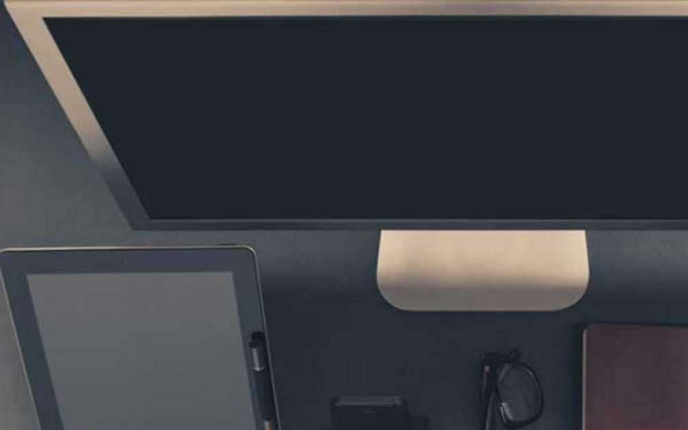
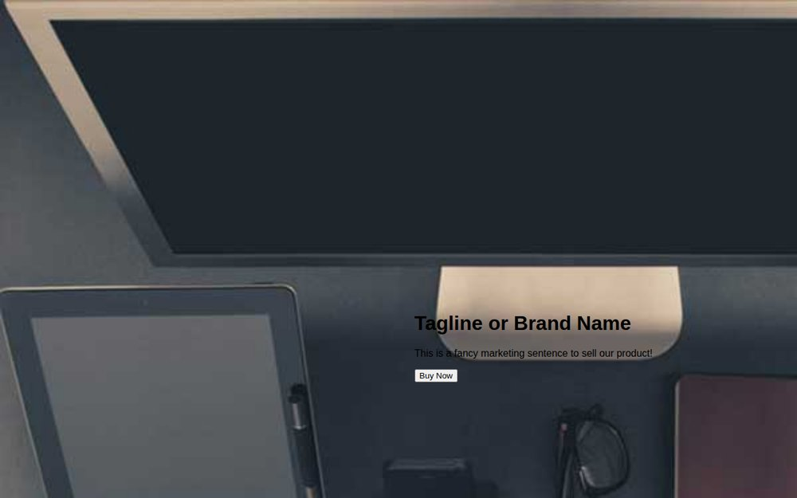
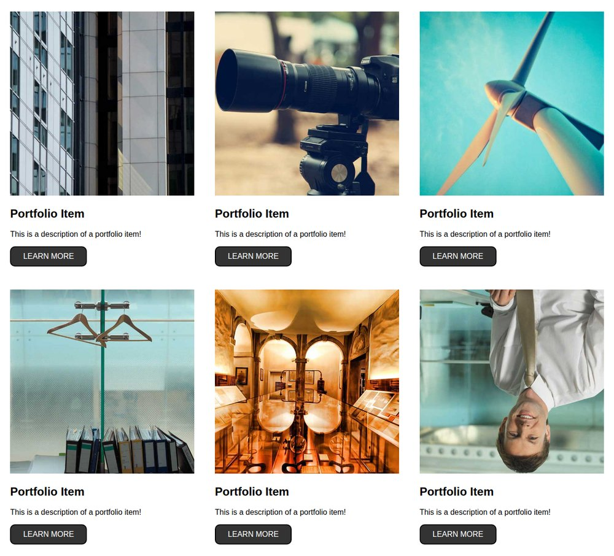
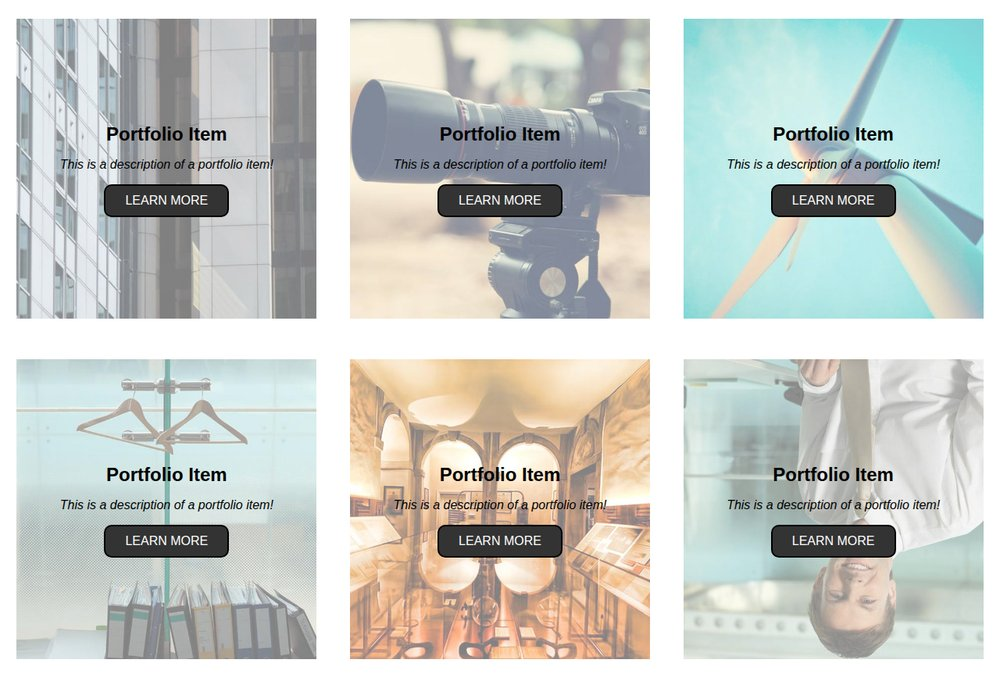
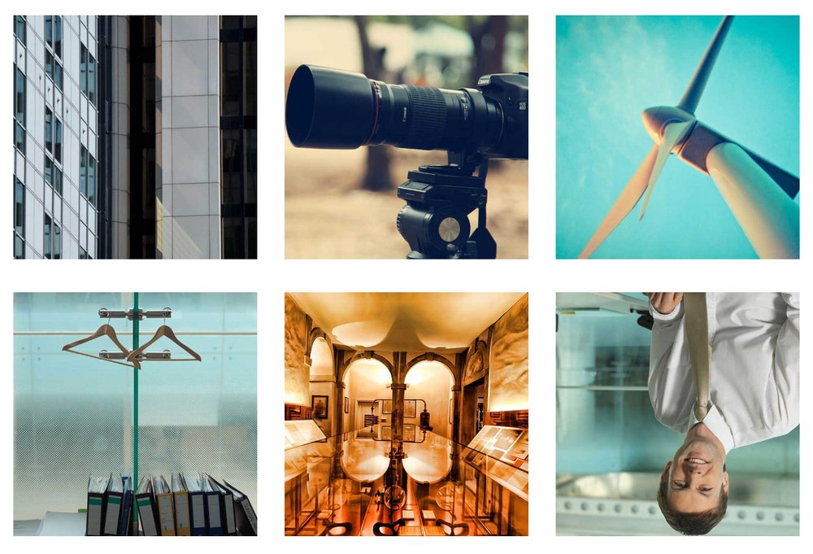
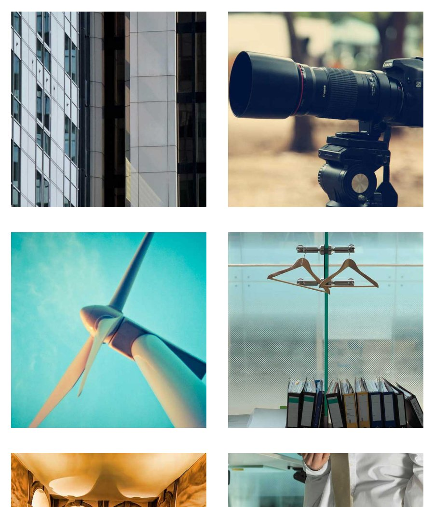
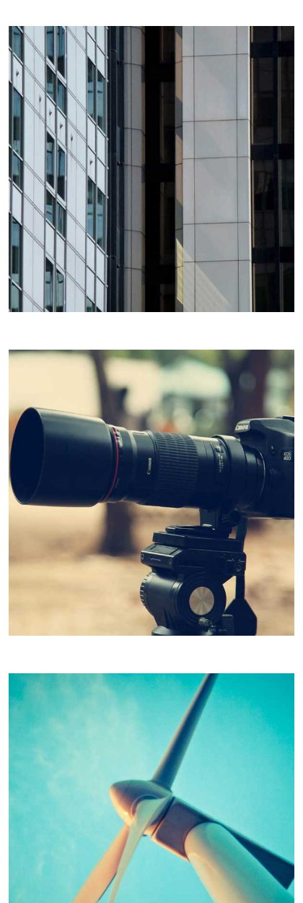

# Week 05 — The Portfolio Page

*A full-bleed hero and a gallery that reacts to your mouse · ~60 min of live coding*

> **Following along at home?** Work through the steps in order. Each step shows what changed, and the full file underneath it. Copy the `img/` folder out of `StarterFiles/` to start — or use your own photographs, which is a better idea if you have them.

This is the first thing we have built that looks like a website someone paid for. Two pieces: a **hero** (the big image with a headline over it — you will also hear it called a jumbotron) and a **gallery** of thumbnails that reveal a caption and swing the photo around when you hover them.

Almost everything here you already know:

- the **box model** and `box-sizing: border-box`, from Week 4 Tuesday
- **`position: relative` on a parent, `position: absolute` on a child**, from Week 4 Thursday and again this morning in the dropdown
- **flexbox**, from Week 4 Thursday

The genuinely new thing is **`transform`** — scaling and rotating an element — and using `transition` to make it happen over time rather than instantly.

Keep this file. You will want the hero for your midterm.

Stuck? Read the error first, then [TROUBLESHOOTING.md](../../../TROUBLESHOOTING.md).

---

## Steps

1. [Files and images](#step-1)
2. [Three global rules](#step-2)
3. [The hero markup](#step-3)
4. [Crop the hero to the window](#step-4)
5. [Float the text over the photo](#step-5)
6. [A gradient so the words are readable](#step-6)
7. [The button, and where a transition belongs](#step-7)
8. [The gallery](#step-8)
9. [The mask](#step-9)
10. [Reveal it on hover](#step-10)
11. [Transform the photo](#step-11)
12. [Stagger the caption](#step-12)
13. [Sneak peek: it is not responsive yet](#step-13)
14. [In-class exercise](#step-14)

At the end: [what to steal for your midterm](#steal).

---

<a id="step-1"></a>

## Step 1 — Files and images

In **your own** homework repo:

```
portfolio/
├── index.html
├── css/
│   └── style.css
└── img/        ← copy this out of StarterFiles/, or use your own photos
```

**`index.html`** — the boilerplate, typed out, with the stylesheet linked:

```html
<!doctype html>
<html lang="en">
  <head>
    <meta charset="utf-8" />
    <meta name="viewport" content="width=device-width, initial-scale=1" />
    <title>Portfolio</title>
    <link rel="stylesheet" href="./css/style.css" />
  </head>
  <body>
  </body>
</html>
```

**`css/style.css`**

```css
/* We write this together in class. */
```

---

<a id="step-2"></a>

## Step 2 — Three global rules

Every project you build from here on opens with some version of these three. They are not design decisions, they are the setup that stops the browser's defaults from fighting you.

**`css/style.css`**

What changed:

```diff
@@ -1 +1,20 @@
 /* We write this together in class. */
+
+/* GLOBAL STYLES */
+
+* {
+  box-sizing: border-box;
+}
+
+/* zero out the default body margin so the hero can touch the edges */
+html,
+body {
+  margin: 0;
+  font-family: 'Helvetica Neue', Arial, sans-serif;
+}
+
+/* every image fills its parent instead of showing at its natural size */
+img {
+  width: 100%;
+  height: auto;
+}
```

- **`box-sizing: border-box` on `*`** — the `*` is the *universal selector*: every element on the page. From Week 4: border-box means padding and border are counted *inside* the width you set, so a 30% box stays 30%.
- **`margin: 0` on `html, body`** — browsers ship with about 8px of body margin. A hero that is supposed to touch all four edges of the window cannot do it with 8px of white around it.
- **`width: 100%` on `img`** — an image would otherwise render at whatever pixel size it happens to be. This says: be as wide as whatever box you are in. `height: auto` keeps the proportions so nothing looks squashed.

<details>
<summary>Full stylesheet after this step</summary>

```css
/* We write this together in class. */

/* GLOBAL STYLES */

* {
  box-sizing: border-box;
}

/* zero out the default body margin so the hero can touch the edges */
html,
body {
  margin: 0;
  font-family: 'Helvetica Neue', Arial, sans-serif;
}

/* every image fills its parent instead of showing at its natural size */
img {
  width: 100%;
  height: auto;
}
```

</details>

Nothing to see yet — the page is still empty.

---

<a id="step-3"></a>

## Step 3 — The hero markup

A `div` with a class of `hero`, holding an image and an `<article>` with the words in it.

**`index.html`**

```html
    <!-- FULL SCREEN JUMBOTRON -->
    <div class="hero">
      
      <article>
        <h1>Tagline or Brand Name</h1>
        <p>This is a fancy marketing sentence to sell our product!</p>
        <button>Buy Now</button>
      </article>
    </div>
```

<details>
<summary>Full <code>index.html</code> after this step</summary>

```html
<!doctype html>
<html lang="en">
  <head>
    <meta charset="utf-8" />
    <meta name="viewport" content="width=device-width, initial-scale=1" />
    <title>Portfolio</title>
    <link rel="stylesheet" href="./css/style.css" />
  </head>
  <body>
    <!-- FULL SCREEN JUMBOTRON -->
    <div class="hero">
      
      <article>
        <h1>Tagline or Brand Name</h1>
        <p>This is a fancy marketing sentence to sell our product!</p>
        <button>Buy Now</button>
      </article>
    </div>
  </body>
</html>
```

</details>


Two problems, and they are the same problem: the image is **1280px tall on a 800px screen** because `width: 100%` made it as wide as the window and `height: auto` kept it in proportion. So the photo runs off the bottom, and the text sits somewhere below it, off screen.

---

<a id="step-4"></a>

## Step 4 — Crop the hero to the window

Four properties on `.hero`, and two of them are new units.

**`css/style.css`**

What changed:

```diff
@@ -18,3 +18,13 @@
   width: 100%;
   height: auto;
 }
+
+/* JUMBOTRON */
+
+.hero {
+  width: 100vw;
+  max-height: 100vh;
+  overflow: hidden;
+  position: relative;
+  margin-bottom: 2rem;
+}
```

- **`100vw`** is 100% of the **v**iewport **w**idth, and `100vh` is 100% of the viewport height. Unlike a percentage, they do not care what the parent is — they measure the window. That is exactly what "full screen hero" means.
- **`max-height: 100vh`** says *never taller than one screen*. The image inside is still 1280px tall...
- ...which is what **`overflow: hidden`** is for: anything sticking out past the box's edges gets clipped off instead of spilling.
- **`position: relative`** does nothing visible at all. It is there so that the `<article>` has something to position against in the next step. Same line, same job, as the `<li>` in the dropdown this morning.

<details>
<summary>Full stylesheet after this step</summary>

```css
/* We write this together in class. */

/* GLOBAL STYLES */

* {
  box-sizing: border-box;
}

/* zero out the default body margin so the hero can touch the edges */
html,
body {
  margin: 0;
  font-family: 'Helvetica Neue', Arial, sans-serif;
}

/* every image fills its parent instead of showing at its natural size */
img {
  width: 100%;
  height: auto;
}

/* JUMBOTRON */

.hero {
  width: 100vw;
  max-height: 100vh;
  overflow: hidden;
  position: relative;
  margin-bottom: 2rem;
}
```

</details>



The hero is the right size now, and **the text has disappeared**. It has not been deleted — it is still at the bottom of a 1280px-tall box whose bottom 480px are being clipped. Which is fine, because we never wanted it down there.

---

<a id="step-5"></a>

## Step 5 — Float the text over the photo

The pattern from this morning, at full size. The parent is positioned (step 4), so now the child can be pulled out of the flow and placed against the parent's edges.

**`css/style.css`**

What changed:

```diff
@@ -28,3 +28,11 @@
   position: relative;
   margin-bottom: 2rem;
 }
+
+.hero article {
+  position: absolute;
+  bottom: 20%;
+  right: 0;
+  width: 50%;
+  padding: 2%;
+}
```

`bottom: 20%` means "my bottom edge sits 20% of the parent's height up from the parent's bottom edge." `right: 0` pins it to the right edge. Percentages here are measured against `.hero`, because `.hero` is the nearest positioned ancestor — if you deleted `position: relative` from step 4, this text would fly to the bottom-right of the whole page instead.

<details>
<summary>Full stylesheet after this step</summary>

```css
/* We write this together in class. */

/* GLOBAL STYLES */

* {
  box-sizing: border-box;
}

/* zero out the default body margin so the hero can touch the edges */
html,
body {
  margin: 0;
  font-family: 'Helvetica Neue', Arial, sans-serif;
}

/* every image fills its parent instead of showing at its natural size */
img {
  width: 100%;
  height: auto;
}

/* JUMBOTRON */

.hero {
  width: 100vw;
  max-height: 100vh;
  overflow: hidden;
  position: relative;
  margin-bottom: 2rem;
}

.hero article {
  position: absolute;
  bottom: 20%;
  right: 0;
  width: 50%;
  padding: 2%;
}
```

</details>



---

<a id="step-6"></a>

## Step 6 — A gradient so the words are readable

Black text on a photograph is a gamble: it works over the dark part and vanishes over the light part. Real sites solve this with a gradient that is opaque behind the text and fades to nothing at the far edge.

**`css/style.css`**

What changed:

```diff
@@ -35,4 +35,10 @@
   right: 0;
   width: 50%;
   padding: 2%;
+  color: #fff;
+  background: linear-gradient(
+    to right,
+    rgba(30, 87, 153, 1) 0%,
+    rgba(125, 185, 232, 0) 100%
+  );
 }
```

`linear-gradient(to right, colour 0%, colour 100%)` is a **background image you write in CSS**. The last value in each `rgba()` is the alpha — `1` is solid, `0` is fully transparent — so this one starts as solid blue on the left and fades out to the right.

<details>
<summary>Full stylesheet after this step</summary>

```css
/* We write this together in class. */

/* GLOBAL STYLES */

* {
  box-sizing: border-box;
}

/* zero out the default body margin so the hero can touch the edges */
html,
body {
  margin: 0;
  font-family: 'Helvetica Neue', Arial, sans-serif;
}

/* every image fills its parent instead of showing at its natural size */
img {
  width: 100%;
  height: auto;
}

/* JUMBOTRON */

.hero {
  width: 100vw;
  max-height: 100vh;
  overflow: hidden;
  position: relative;
  margin-bottom: 2rem;
}

.hero article {
  position: absolute;
  bottom: 20%;
  right: 0;
  width: 50%;
  padding: 2%;
  color: #fff;
  background: linear-gradient(
    to right,
    rgba(30, 87, 153, 1) 0%,
    rgba(125, 185, 232, 0) 100%
  );
}
```

</details>


Design note worth ten seconds: this is not decoration, it is legibility. Swap in your own photo and the gradient keeps your headline readable no matter what is behind it.

---

<a id="step-7"></a>

## Step 7 — The button, and where a transition belongs

One rule for two different elements: the real `<button>` in the hero and the `<a class="info">` links we are about to put in the gallery. Styling them together means they cannot drift apart later.

**`css/style.css`**

What changed:

```diff
@@ -42,3 +42,26 @@
     rgba(125, 185, 232, 0) 100%
   );
 }
+
+button,
+a.info {
+  display: inline-block;
+  width: 10rem;
+  padding: 10px 20px;
+  border: 2px solid black;
+  border-radius: 10px;
+  color: white;
+  background-color: #333;
+  text-transform: uppercase;
+  text-align: center;
+  text-decoration: none;
+  cursor: pointer;
+  /* the transition lives on the RESTING state, not on :hover */
+  transition: all 1s ease;
+}
+
+button:hover,
+a.info:hover {
+  background-color: chartreuse;
+  color: #333;
+}
```

The line that matters:

```css
transition: all 1s ease;
```

It is on the **resting** state, not on `:hover`. Read it as *"whenever any property of this element changes, take one second to do it"* — which covers the change on the way in and on the way out. Put it inside the `:hover` block instead and the colour fades in but snaps back. Try it both ways once; you will never wonder again.

`ease` is the speed curve: start slow, speed up, end slow. The alternatives are `linear`, `ease-in`, `ease-out` and `ease-in-out`, and they are worth ten minutes of play at some point.

<details>
<summary>Full stylesheet after this step</summary>

```css
/* We write this together in class. */

/* GLOBAL STYLES */

* {
  box-sizing: border-box;
}

/* zero out the default body margin so the hero can touch the edges */
html,
body {
  margin: 0;
  font-family: 'Helvetica Neue', Arial, sans-serif;
}

/* every image fills its parent instead of showing at its natural size */
img {
  width: 100%;
  height: auto;
}

/* JUMBOTRON */

.hero {
  width: 100vw;
  max-height: 100vh;
  overflow: hidden;
  position: relative;
  margin-bottom: 2rem;
}

.hero article {
  position: absolute;
  bottom: 20%;
  right: 0;
  width: 50%;
  padding: 2%;
  color: #fff;
  background: linear-gradient(
    to right,
    rgba(30, 87, 153, 1) 0%,
    rgba(125, 185, 232, 0) 100%
  );
}

button,
a.info {
  display: inline-block;
  width: 10rem;
  padding: 10px 20px;
  border: 2px solid black;
  border-radius: 10px;
  color: white;
  background-color: #333;
  text-transform: uppercase;
  text-align: center;
  text-decoration: none;
  cursor: pointer;
  /* the transition lives on the RESTING state, not on :hover */
  transition: all 1s ease;
}

button:hover,
a.info:hover {
  background-color: chartreuse;
  color: #333;
}
```

</details>


Hover the button and watch the green arrive over a full second. One second is *slow* for a real interface — 0.2 to 0.3 is normal — but it is exactly right while you are learning, because you can see what is happening.

---

<a id="step-8"></a>

## Step 8 — The gallery

Back to the HTML. Under the hero, a `.container` holding six `.thumb` divs. Each thumb is an image plus an `<article class="mask">` with a heading, a line of text and a Learn More link.

**`index.html`** — one thumb, repeated six times with a different image in each:

```html
      <div class="thumb">
        
        <article class="mask">
          <h2>Portfolio Item</h2>
          <p>This is a description of a portfolio item!</p>
          <a class="info" href="#">Learn More</a>
        </article>
      </div>
```

<details>
<summary>Full <code>index.html</code> after this step</summary>

```html
<!doctype html>
<html lang="en">
  <head>
    <meta charset="utf-8" />
    <meta name="viewport" content="width=device-width, initial-scale=1" />
    <title>Portfolio</title>
    <link rel="stylesheet" href="./css/style.css" />
  </head>
  <body>
    <!-- FULL SCREEN JUMBOTRON -->
    <div class="hero">
      
      <article>
        <h1>Tagline or Brand Name</h1>
        <p>This is a fancy marketing sentence to sell our product!</p>
        <button>Buy Now</button>
      </article>
    </div>

    <!-- GALLERY -->
    <div class="container">
      <div class="thumb">
        
        <article class="mask">
          <h2>Portfolio Item</h2>
          <p>This is a description of a portfolio item!</p>
          <a class="info" href="#">Learn More</a>
        </article>
      </div>

      <div class="thumb">
        
        <article class="mask">
          <h2>Portfolio Item</h2>
          <p>This is a description of a portfolio item!</p>
          <a class="info" href="#">Learn More</a>
        </article>
      </div>

      <div class="thumb">
        
        <article class="mask">
          <h2>Portfolio Item</h2>
          <p>This is a description of a portfolio item!</p>
          <a class="info" href="#">Learn More</a>
        </article>
      </div>

      <div class="thumb">
        
        <article class="mask">
          <h2>Portfolio Item</h2>
          <p>This is a description of a portfolio item!</p>
          <a class="info" href="#">Learn More</a>
        </article>
      </div>

      <div class="thumb">
        
        <article class="mask">
          <h2>Portfolio Item</h2>
          <p>This is a description of a portfolio item!</p>
          <a class="info" href="#">Learn More</a>
        </article>
      </div>

      <div class="thumb">
        
        <article class="mask">
          <h2>Portfolio Item</h2>
          <p>This is a description of a portfolio item!</p>
          <a class="info" href="#">Learn More</a>
        </article>
      </div>
    </div>
  </body>
</html>
```

</details>

Then the flexbox, which is Thursday's lesson with no new ideas in it:

**`css/style.css`**

What changed:

```diff
@@ -65,3 +65,19 @@
   background-color: chartreuse;
   color: #333;
 }
+
+/* GALLERY */
+
+.container {
+  width: 100%;
+  display: flex;
+  flex-direction: row;
+  flex-wrap: wrap;
+  justify-content: space-between;
+}
+
+.thumb {
+  /* grow: 0 · shrink: 0 · basis: 30% */
+  flex: 0 0 30%;
+  margin: 1.5rem auto;
+}
```

`flex: 0 0 30%` is three values in one property — **grow, shrink, basis**:

- **grow: 0** — do not take any of the leftover space
- **shrink: 0** — do not give any up either
- **basis: 30%** — be 30% of the container

Three at 30% is 90%, and `justify-content: space-between` spreads the remaining 10% between them. `flex-wrap: wrap` sends thumbs four, five and six to a second row.

<details>
<summary>Full stylesheet after this step</summary>

```css
/* We write this together in class. */

/* GLOBAL STYLES */

* {
  box-sizing: border-box;
}

/* zero out the default body margin so the hero can touch the edges */
html,
body {
  margin: 0;
  font-family: 'Helvetica Neue', Arial, sans-serif;
}

/* every image fills its parent instead of showing at its natural size */
img {
  width: 100%;
  height: auto;
}

/* JUMBOTRON */

.hero {
  width: 100vw;
  max-height: 100vh;
  overflow: hidden;
  position: relative;
  margin-bottom: 2rem;
}

.hero article {
  position: absolute;
  bottom: 20%;
  right: 0;
  width: 50%;
  padding: 2%;
  color: #fff;
  background: linear-gradient(
    to right,
    rgba(30, 87, 153, 1) 0%,
    rgba(125, 185, 232, 0) 100%
  );
}

button,
a.info {
  display: inline-block;
  width: 10rem;
  padding: 10px 20px;
  border: 2px solid black;
  border-radius: 10px;
  color: white;
  background-color: #333;
  text-transform: uppercase;
  text-align: center;
  text-decoration: none;
  cursor: pointer;
  /* the transition lives on the RESTING state, not on :hover */
  transition: all 1s ease;
}

button:hover,
a.info:hover {
  background-color: chartreuse;
  color: #333;
}

/* GALLERY */

.container {
  width: 100%;
  display: flex;
  flex-direction: row;
  flex-wrap: wrap;
  justify-content: space-between;
}

.thumb {
  /* grow: 0 · shrink: 0 · basis: 30% */
  flex: 0 0 30%;
  margin: 1.5rem auto;
}
```

</details>



The captions are sitting *under* the photos because they are just article elements in the flow. They are supposed to be *on top* of them, hidden until hover. That is the next two steps.

---

<a id="step-9"></a>

## Step 9 — The mask

The pattern for the third time today, and this is the version worth memorising: **pin all four edges**. An absolutely positioned element with `top`, `right`, `bottom` and `left` all set to `0` stretches to exactly cover its positioned parent — no width, no height, no maths, and it keeps covering it when the parent changes size.

For that to work, `.thumb` needs to be a positioning parent — and it needs `overflow: hidden`, which does nothing yet but will matter enormously in step 11.

**`css/style.css`**

What changed:

```diff
@@ -80,4 +80,29 @@
   /* grow: 0 · shrink: 0 · basis: 30% */
   flex: 0 0 30%;
   margin: 1.5rem auto;
+  position: relative;
+  overflow: hidden;
 }
+
+.mask {
+  /* pin all four edges to the parent's edges — no width or height needed */
+  position: absolute;
+  top: 0;
+  right: 0;
+  bottom: 0;
+  left: 0;
+  /* centre the contents on both axes */
+  display: flex;
+  flex-direction: column;
+  justify-content: center;
+  align-items: center;
+  background-color: rgba(255, 255, 255, 0.5);
+}
+
+.mask h2 {
+  margin: 0;
+}
+
+.mask p {
+  font-style: italic;
+}
```

The centring is flexbox again, this time on a tiny scale: `flex-direction: column` stacks the three children, `justify-content: center` centres them along that column, `align-items: center` centres them across it. Vertical centring used to be genuinely hard. It is three lines now.

<details>
<summary>Full stylesheet after this step</summary>

```css
/* We write this together in class. */

/* GLOBAL STYLES */

* {
  box-sizing: border-box;
}

/* zero out the default body margin so the hero can touch the edges */
html,
body {
  margin: 0;
  font-family: 'Helvetica Neue', Arial, sans-serif;
}

/* every image fills its parent instead of showing at its natural size */
img {
  width: 100%;
  height: auto;
}

/* JUMBOTRON */

.hero {
  width: 100vw;
  max-height: 100vh;
  overflow: hidden;
  position: relative;
  margin-bottom: 2rem;
}

.hero article {
  position: absolute;
  bottom: 20%;
  right: 0;
  width: 50%;
  padding: 2%;
  color: #fff;
  background: linear-gradient(
    to right,
    rgba(30, 87, 153, 1) 0%,
    rgba(125, 185, 232, 0) 100%
  );
}

button,
a.info {
  display: inline-block;
  width: 10rem;
  padding: 10px 20px;
  border: 2px solid black;
  border-radius: 10px;
  color: white;
  background-color: #333;
  text-transform: uppercase;
  text-align: center;
  text-decoration: none;
  cursor: pointer;
  /* the transition lives on the RESTING state, not on :hover */
  transition: all 1s ease;
}

button:hover,
a.info:hover {
  background-color: chartreuse;
  color: #333;
}

/* GALLERY */

.container {
  width: 100%;
  display: flex;
  flex-direction: row;
  flex-wrap: wrap;
  justify-content: space-between;
}

.thumb {
  /* grow: 0 · shrink: 0 · basis: 30% */
  flex: 0 0 30%;
  margin: 1.5rem auto;
  position: relative;
  overflow: hidden;
}

.mask {
  /* pin all four edges to the parent's edges — no width or height needed */
  position: absolute;
  top: 0;
  right: 0;
  bottom: 0;
  left: 0;
  /* centre the contents on both axes */
  display: flex;
  flex-direction: column;
  justify-content: center;
  align-items: center;
  background-color: rgba(255, 255, 255, 0.5);
}

.mask h2 {
  margin: 0;
}

.mask p {
  font-style: italic;
}
```

</details>



Each caption now covers its photo, in a half-transparent white box (`rgba(255, 255, 255, 0.5)` — white at 50% alpha). Permanently. Which is not what we want either.

---

<a id="step-10"></a>

## Step 10 — Reveal it on hover

Hide the mask with `opacity: 0` and bring it back when the thumb is hovered.

**Why `opacity` and not `display: none`?** Because you cannot transition `display` — there is no halfway between displayed and not displayed, so it can only ever snap. `opacity` has a thousand in-between states, so it can fade. That is the trade: `display: none` removes the element from the page entirely, `opacity: 0` leaves it there, taking up its space, invisible. Here we *want* it to stay exactly where it is.

**`css/style.css`**

What changed:

```diff
@@ -97,6 +97,8 @@
   justify-content: center;
   align-items: center;
   background-color: rgba(255, 255, 255, 0.5);
+  opacity: 0;
+  transition: all 1s ease;
 }
 
 .mask h2 {
@@ -106,3 +108,7 @@
 .mask p {
   font-style: italic;
 }
+
+.thumb:hover .mask {
+  opacity: 1;
+}
```

<details>
<summary>Full stylesheet after this step</summary>

```css
/* We write this together in class. */

/* GLOBAL STYLES */

* {
  box-sizing: border-box;
}

/* zero out the default body margin so the hero can touch the edges */
html,
body {
  margin: 0;
  font-family: 'Helvetica Neue', Arial, sans-serif;
}

/* every image fills its parent instead of showing at its natural size */
img {
  width: 100%;
  height: auto;
}

/* JUMBOTRON */

.hero {
  width: 100vw;
  max-height: 100vh;
  overflow: hidden;
  position: relative;
  margin-bottom: 2rem;
}

.hero article {
  position: absolute;
  bottom: 20%;
  right: 0;
  width: 50%;
  padding: 2%;
  color: #fff;
  background: linear-gradient(
    to right,
    rgba(30, 87, 153, 1) 0%,
    rgba(125, 185, 232, 0) 100%
  );
}

button,
a.info {
  display: inline-block;
  width: 10rem;
  padding: 10px 20px;
  border: 2px solid black;
  border-radius: 10px;
  color: white;
  background-color: #333;
  text-transform: uppercase;
  text-align: center;
  text-decoration: none;
  cursor: pointer;
  /* the transition lives on the RESTING state, not on :hover */
  transition: all 1s ease;
}

button:hover,
a.info:hover {
  background-color: chartreuse;
  color: #333;
}

/* GALLERY */

.container {
  width: 100%;
  display: flex;
  flex-direction: row;
  flex-wrap: wrap;
  justify-content: space-between;
}

.thumb {
  /* grow: 0 · shrink: 0 · basis: 30% */
  flex: 0 0 30%;
  margin: 1.5rem auto;
  position: relative;
  overflow: hidden;
}

.mask {
  /* pin all four edges to the parent's edges — no width or height needed */
  position: absolute;
  top: 0;
  right: 0;
  bottom: 0;
  left: 0;
  /* centre the contents on both axes */
  display: flex;
  flex-direction: column;
  justify-content: center;
  align-items: center;
  background-color: rgba(255, 255, 255, 0.5);
  opacity: 0;
  transition: all 1s ease;
}

.mask h2 {
  margin: 0;
}

.mask p {
  font-style: italic;
}

.thumb:hover .mask {
  opacity: 1;
}
```

</details>

Resting:



Hovering one thumb:


---

<a id="step-11"></a>

## Step 11 — Transform the photo

Here is the new property. **`transform`** moves, rotates, scales or skews an element without disturbing anything around it — the page keeps the space the element originally had, so nothing else jumps.

```css
transform: scale(1.5);            /* 150% of its own size */
transform: rotate(-20deg);        /* negative is counter-clockwise */
transform: translate(10px, 20px); /* nudge right and down */
transform: skew(10deg, 4deg);     /* lean it over */
```

You can combine them in one declaration, and **the order matters** — `scale(1.5) rotate(-20deg)` and `rotate(-20deg) scale(1.5)` are different operations.

Two rules. The first declares the image's resting state, which sounds pointless — `scale(1)` and `rotate(0deg)` mean "normal size, not rotated" — but you cannot transition *from* nothing. Give the browser a starting value and an ending value and it can animate between them.

**`css/style.css`**

What changed:

```diff
@@ -112,3 +112,13 @@
 .thumb:hover .mask {
   opacity: 1;
 }
+
+/* the image's resting state — you cannot transition FROM nothing */
+.thumb img {
+  transform: scale(1) rotate(0deg);
+  transition: all 1s ease;
+}
+
+.thumb:hover img {
+  transform: scale(1.5) rotate(-20deg);
+}
```

<details>
<summary>Full stylesheet after this step</summary>

```css
/* We write this together in class. */

/* GLOBAL STYLES */

* {
  box-sizing: border-box;
}

/* zero out the default body margin so the hero can touch the edges */
html,
body {
  margin: 0;
  font-family: 'Helvetica Neue', Arial, sans-serif;
}

/* every image fills its parent instead of showing at its natural size */
img {
  width: 100%;
  height: auto;
}

/* JUMBOTRON */

.hero {
  width: 100vw;
  max-height: 100vh;
  overflow: hidden;
  position: relative;
  margin-bottom: 2rem;
}

.hero article {
  position: absolute;
  bottom: 20%;
  right: 0;
  width: 50%;
  padding: 2%;
  color: #fff;
  background: linear-gradient(
    to right,
    rgba(30, 87, 153, 1) 0%,
    rgba(125, 185, 232, 0) 100%
  );
}

button,
a.info {
  display: inline-block;
  width: 10rem;
  padding: 10px 20px;
  border: 2px solid black;
  border-radius: 10px;
  color: white;
  background-color: #333;
  text-transform: uppercase;
  text-align: center;
  text-decoration: none;
  cursor: pointer;
  /* the transition lives on the RESTING state, not on :hover */
  transition: all 1s ease;
}

button:hover,
a.info:hover {
  background-color: chartreuse;
  color: #333;
}

/* GALLERY */

.container {
  width: 100%;
  display: flex;
  flex-direction: row;
  flex-wrap: wrap;
  justify-content: space-between;
}

.thumb {
  /* grow: 0 · shrink: 0 · basis: 30% */
  flex: 0 0 30%;
  margin: 1.5rem auto;
  position: relative;
  overflow: hidden;
}

.mask {
  /* pin all four edges to the parent's edges — no width or height needed */
  position: absolute;
  top: 0;
  right: 0;
  bottom: 0;
  left: 0;
  /* centre the contents on both axes */
  display: flex;
  flex-direction: column;
  justify-content: center;
  align-items: center;
  background-color: rgba(255, 255, 255, 0.5);
  opacity: 0;
  transition: all 1s ease;
}

.mask h2 {
  margin: 0;
}

.mask p {
  font-style: italic;
}

.thumb:hover .mask {
  opacity: 1;
}

/* the image's resting state — you cannot transition FROM nothing */
.thumb img {
  transform: scale(1) rotate(0deg);
  transition: all 1s ease;
}

.thumb:hover img {
  transform: scale(1.5) rotate(-20deg);
}
```

</details>


Now you see what `overflow: hidden` on `.thumb` was for. The photo is 150% of its box and rotated 20 degrees, so its corners swing well outside the thumbnail — without `overflow: hidden` it would sprawl over its neighbours. With it, the thumbnail stays a crisp rectangle and the image moves *inside* it, like a photo behind a mat.

Take `overflow: hidden` off for five seconds and put it back. It is the difference between a portfolio and a mess.

---

<a id="step-12"></a>

## Step 12 — Stagger the caption

One more layer: the caption's contents start at zero size and grow into place, so the whole thing assembles itself instead of just appearing.

**`css/style.css`**

What changed:

```diff
@@ -122,3 +122,18 @@
 .thumb:hover img {
   transform: scale(1.5) rotate(-20deg);
 }
+
+.thumb .mask h2,
+.thumb .mask p,
+.thumb .mask a {
+  opacity: 0;
+  transform: scale(0);
+  transition: all 1s ease-in-out;
+}
+
+.thumb:hover .mask h2,
+.thumb:hover .mask p,
+.thumb:hover .mask a {
+  opacity: 1;
+  transform: scale(1.25);
+}
```

`scale(0)` is genuinely zero — the element is there, at no size. On hover it goes to `scale(1.25)`, slightly bigger than natural, which reads as a small pop. `ease-in-out` on this one makes it land more gently than the image behind it.

<details>
<summary>Full stylesheet after this step</summary>

```css
/* We write this together in class. */

/* GLOBAL STYLES */

* {
  box-sizing: border-box;
}

/* zero out the default body margin so the hero can touch the edges */
html,
body {
  margin: 0;
  font-family: 'Helvetica Neue', Arial, sans-serif;
}

/* every image fills its parent instead of showing at its natural size */
img {
  width: 100%;
  height: auto;
}

/* JUMBOTRON */

.hero {
  width: 100vw;
  max-height: 100vh;
  overflow: hidden;
  position: relative;
  margin-bottom: 2rem;
}

.hero article {
  position: absolute;
  bottom: 20%;
  right: 0;
  width: 50%;
  padding: 2%;
  color: #fff;
  background: linear-gradient(
    to right,
    rgba(30, 87, 153, 1) 0%,
    rgba(125, 185, 232, 0) 100%
  );
}

button,
a.info {
  display: inline-block;
  width: 10rem;
  padding: 10px 20px;
  border: 2px solid black;
  border-radius: 10px;
  color: white;
  background-color: #333;
  text-transform: uppercase;
  text-align: center;
  text-decoration: none;
  cursor: pointer;
  /* the transition lives on the RESTING state, not on :hover */
  transition: all 1s ease;
}

button:hover,
a.info:hover {
  background-color: chartreuse;
  color: #333;
}

/* GALLERY */

.container {
  width: 100%;
  display: flex;
  flex-direction: row;
  flex-wrap: wrap;
  justify-content: space-between;
}

.thumb {
  /* grow: 0 · shrink: 0 · basis: 30% */
  flex: 0 0 30%;
  margin: 1.5rem auto;
  position: relative;
  overflow: hidden;
}

.mask {
  /* pin all four edges to the parent's edges — no width or height needed */
  position: absolute;
  top: 0;
  right: 0;
  bottom: 0;
  left: 0;
  /* centre the contents on both axes */
  display: flex;
  flex-direction: column;
  justify-content: center;
  align-items: center;
  background-color: rgba(255, 255, 255, 0.5);
  opacity: 0;
  transition: all 1s ease;
}

.mask h2 {
  margin: 0;
}

.mask p {
  font-style: italic;
}

.thumb:hover .mask {
  opacity: 1;
}

/* the image's resting state — you cannot transition FROM nothing */
.thumb img {
  transform: scale(1) rotate(0deg);
  transition: all 1s ease;
}

.thumb:hover img {
  transform: scale(1.5) rotate(-20deg);
}

.thumb .mask h2,
.thumb .mask p,
.thumb .mask a {
  opacity: 0;
  transform: scale(0);
  transition: all 1s ease-in-out;
}

.thumb:hover .mask h2,
.thumb:hover .mask p,
.thumb:hover .mask a {
  opacity: 1;
  transform: scale(1.25);
}
```

</details>


That is the lesson. Hover each thumbnail and watch three things happen at once, all of them on a one-second clock: the photo grows and turns, the mask fades up, the text scales in.

---

<a id="step-13"></a>

## Step 13 — Sneak peek: it is not responsive yet

Drag your browser window narrow. The three-across gallery stays three across, the thumbnails get squeezed to nothing, and the hero text stays at 50% of a width that no longer has 50% to spare.

Next week's lesson is **media queries**: a block of CSS that only applies when the window is a certain size. Paste this at the bottom of your stylesheet to see where we are going — we will build it properly in Week 06.

```diff
@@ -137,3 +137,30 @@
   opacity: 1;
   transform: scale(1.25);
 }
+
+/* MEDIA QUERIES — Week 06 */
+
+/* tablet landscape and smaller */
+@media screen and (width <= 1024px) {
+  .hero article {
+    width: 80%;
+  }
+
+  .thumb {
+    flex-basis: 45%;
+  }
+}
+
+/* phones */
+@media screen and (width < 768px) {
+  .hero article {
+    width: 100%;
+    bottom: 1%;
+    padding: 1.5rem;
+  }
+
+  .container {
+    flex-direction: column;
+    padding: 0.75rem;
+  }
+}
```

<details>
<summary>Full stylesheet after this step</summary>

```css
/* We write this together in class. */

/* GLOBAL STYLES */

* {
  box-sizing: border-box;
}

/* zero out the default body margin so the hero can touch the edges */
html,
body {
  margin: 0;
  font-family: 'Helvetica Neue', Arial, sans-serif;
}

/* every image fills its parent instead of showing at its natural size */
img {
  width: 100%;
  height: auto;
}

/* JUMBOTRON */

.hero {
  width: 100vw;
  max-height: 100vh;
  overflow: hidden;
  position: relative;
  margin-bottom: 2rem;
}

.hero article {
  position: absolute;
  bottom: 20%;
  right: 0;
  width: 50%;
  padding: 2%;
  color: #fff;
  background: linear-gradient(
    to right,
    rgba(30, 87, 153, 1) 0%,
    rgba(125, 185, 232, 0) 100%
  );
}

button,
a.info {
  display: inline-block;
  width: 10rem;
  padding: 10px 20px;
  border: 2px solid black;
  border-radius: 10px;
  color: white;
  background-color: #333;
  text-transform: uppercase;
  text-align: center;
  text-decoration: none;
  cursor: pointer;
  /* the transition lives on the RESTING state, not on :hover */
  transition: all 1s ease;
}

button:hover,
a.info:hover {
  background-color: chartreuse;
  color: #333;
}

/* GALLERY */

.container {
  width: 100%;
  display: flex;
  flex-direction: row;
  flex-wrap: wrap;
  justify-content: space-between;
}

.thumb {
  /* grow: 0 · shrink: 0 · basis: 30% */
  flex: 0 0 30%;
  margin: 1.5rem auto;
  position: relative;
  overflow: hidden;
}

.mask {
  /* pin all four edges to the parent's edges — no width or height needed */
  position: absolute;
  top: 0;
  right: 0;
  bottom: 0;
  left: 0;
  /* centre the contents on both axes */
  display: flex;
  flex-direction: column;
  justify-content: center;
  align-items: center;
  background-color: rgba(255, 255, 255, 0.5);
  opacity: 0;
  transition: all 1s ease;
}

.mask h2 {
  margin: 0;
}

.mask p {
  font-style: italic;
}

.thumb:hover .mask {
  opacity: 1;
}

/* the image's resting state — you cannot transition FROM nothing */
.thumb img {
  transform: scale(1) rotate(0deg);
  transition: all 1s ease;
}

.thumb:hover img {
  transform: scale(1.5) rotate(-20deg);
}

.thumb .mask h2,
.thumb .mask p,
.thumb .mask a {
  opacity: 0;
  transform: scale(0);
  transition: all 1s ease-in-out;
}

.thumb:hover .mask h2,
.thumb:hover .mask p,
.thumb:hover .mask a {
  opacity: 1;
  transform: scale(1.25);
}

/* MEDIA QUERIES — Week 06 */

/* tablet landscape and smaller */
@media screen and (width <= 1024px) {
  .hero article {
    width: 80%;
  }

  .thumb {
    flex-basis: 45%;
  }
}

/* phones */
@media screen and (width < 768px) {
  .hero article {
    width: 100%;
    bottom: 1%;
    padding: 1.5rem;
  }

  .container {
    flex-direction: column;
    padding: 0.75rem;
  }
}
```

</details>

At tablet width the thumbs go 45% — two across:



On a phone the container switches to a column and each photo gets the full width:



Same HTML. Three layouts. That is responsive design in one screenshot, and it is Week 06.

---

<a id="step-14"></a>

## Step 14 — In-class exercise

Take the hover effect somewhere else. Pick one:

- **Change the motion.** Replace `scale(1.5) rotate(-20deg)` with something of your own — a slow `translate` that drifts the photo sideways, a `skew`, a smaller scale with a longer duration. Write down which one you would actually ship and why.
- **Invert the mask.** Make the mask dark with light text instead of light with dark text, and make it slide up from the bottom rather than fade in. (`transform: translateY(100%)` at rest, `translateY(0)` on hover — and you already have `overflow: hidden` to hide it while it waits.)
- **A fourth thumbnail row of your own photographs**, sized sensibly before you put them in the page. If you are shooting your midterm site's images this week, this is free work.

---

<a id="steal"></a>

## What to steal for your midterm

| Pattern | The lines | Where it shows up |
|---|---|---|
| Full-bleed hero | `100vw` / `max-height: 100vh` / `overflow: hidden` | Nearly every homepage |
| Text over an image | `position: relative` parent + `position: absolute` child | Heroes, captions, badges |
| Readable text on a photo | `linear-gradient` with an `rgba()` fade | Any headline over a photograph |
| Stretch a layer over a box | `position: absolute` + all four edges `0` | Hover masks, overlays, modals |
| Centre anything | `display: flex` + `justify-content` + `align-items` | Everywhere, forever |
| Motion that is not annoying | `transition` on the resting state | Buttons, links, cards |
| Move without disturbing the page | `transform` + `overflow: hidden` on the parent | Image hovers, zoom effects |

Remember that **midterm proposals are presented Thursday** — concept, an inspiration site, what you can already build, what you still need, and a wireframe or sitemap. If your wireframe has a big image with words on it, you now know exactly how to build it.
