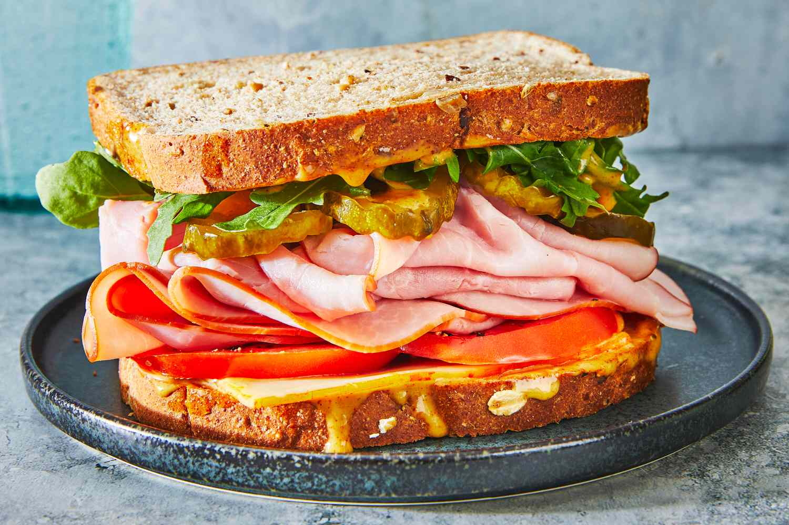

# Sandwich Recipe

Description

### Ingredients
- Bread
- Ham
- Cheese
- Lettuce
- Mayonnaise

### Instructions
1. Get two slices of bread.
2. Add cheese, meat, or veggies.
3. Add sauce or condiments.
4. Put the second slice on top.
5. Cut and serve.

[you can find the original recipe here](https://www.acozykitchen.com/how-to-make-a-tomato-sandwich)